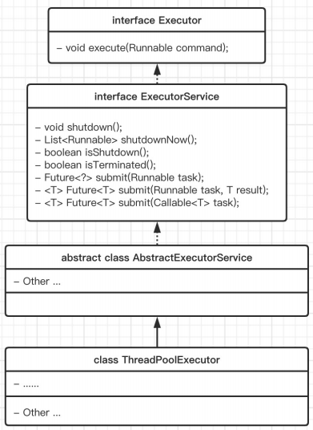

## 为什么用线程池

线程池（Thread Pool）是一种基于池化（Pooling）思想管理线程的工具。

线程数据比较重量级的资源。

- 线程过多会带来额外的开销，其中包括创建销毁线程的开销、调度线程的开销等等，降低了计算机的整体性能。
- 对于重量级资源，倾向于用维护一个资源池的方式使用


线程池维护多个线程，等待监督管理者分配可并发执行的任务。这种做法，一方面避免了处理任务时创建销毁线程开销的代价，另一方面避免了线程数量膨胀导致的过分调度问题，保证了对内核的充分利用。

- **降低资源消耗**：通过池化技术重复利用已创建的线程，降低线程创建和销毁造成的损耗。
- **提高响应速度**：任务到达时，无需等待线程创建即可立即执行。
- **提高线程的可管理性**：线程是稀缺资源，如果无限制创建，不仅会消耗系统资源，还会因为线程的不合理分布导致资源调度失衡，降低系统的稳定性。使用线程池可以进行统一的分配、调优和监控。
- **提供更多更强大的功能**：线程池具备可拓展性，允许开发人员向其中增加更多的功能。比如延时定时线程池ScheduledThreadPoolExecutor，就允许任务延期执行或定期执行。


核心问题就是资源管理问题，最大化收益并最小化风险。


## ThreadPoolExecutor

### 总体设计

通用的线程池除了各种资源的设置，还需要管理峰值下的任务处理机制，其抽象实现有一定的复杂度。JDK已经做好了抽象线程池的定义及实现。

1. Excutor: 执行者，顶层抽象接口
2. ExcutorService: 接口 API
3. ThreadFactory: 线程工厂，配置executor参数
4. ThreadPoolExecutor 最常用
5. Excutors: 工具类，很多静态方法，帮助创建常用的线程池类型


Java中的线程池核心实现类是ThreadPoolExecutor。

Executor -> ExecutorService-> AbstractExecutorService -> ThreadPoolExecutor 

顶层接口是Executor，提供了一种思想：将任务提交和任务执行进行解耦。

- 线程池在内部实际上构建了一个生产者消费者模型，将线程和任务两者解耦，并不直接关联，从而良好的缓冲任务，复用线程。


### Executor – 执行者


```java
void execute(Runnable command); 执行可运行的任务
```




线程池从功能上看，它就是一个任务执行器

### ExecutorService

submit 方法 -> 有返回值，用 Future 封装
execute 方法 -> 无返回值

submit 方法还异常可以在主线程中 get 捕获到

execute 方法执行任务是捕捉不到异常的


shutdown()：停止接收新任务，原来的任务继续执行。

- 更graceful

shutdownNow()：停止接收新任务，原来的任务停止执行

boolean awaitTermination(timeOut, unit)：阻塞当前线程，返回是否线程都执行完


如果shutdown一直无法完成，应该如何处理？一种更好的停止策略

- awaitTermination 一定时间，等待所有线程全部完成
- 到时后根据返回值判断是否所有的线程都停止
- 如果没有可以调用shutdownNow停止运行时间过长的线程
  - 一般这时业务角度已经超时

### ThreadPoolExecutor

线程池的实现类。

An ExecutorService that executes each **submitted task** using one of possibly several pooled threads, normally **configured using Executors factory methods**.


Thread pools address two different problems: 

1. they usually provide improved performance when executing large numbers of asynchronous tasks, due to **reduced per-task invocation** overhead
2. and they provide a means of **bounding and managing the resources**, including threads, consumed when executing a collection of tasks. 

Each ThreadPoolExecutor also maintains some basic statistics, such as the number of completed tasks.


```java
private final class Worker extends AbstractQueuedSynchronizer implements Runnable
  
```


#### ctl

The main pool control state, ctl, is an atomic integer packing two conceptual fields

- workerCount, indicating the effective number of threads
- runState,    indicating whether running, shutting down etc

把一个 int 变量拆成两部分来用。前面3位用来表示状态，后面29位用来表示工作线程数量


```java
private final AtomicInteger ctl = new AtomicInteger(ctlOf(RUNNING, 0));

private static final int COUNT_BITS = Integer.SIZE - 3;      // 29
private static final int CAPACITY   = (1 << COUNT_BITS) - 1; // 00011111 ... ... 11111111

// 状态在高位存储
private static final int RUNNING    = -1 << COUNT_BITS;      // 11100000 ... ... 00000000
private static final int SHUTDOWN   =  0 << COUNT_BITS;      // 00000000 ... ... 00000000
private static final int STOP       =  1 << COUNT_BITS;      // 00100000 ... ... 00000000
private static final int TIDYING    =  2 << COUNT_BITS;      // 01000000 ... ... 00000000
private static final int TERMINATED =  3 << COUNT_BITS;      // 01100000 ... ... 00000000

private static int ctlOf(int rs, int wc) { return rs | wc; }


private static final int CAPACITY   = (1 << COUNT_BITS) - 1;

// CAPACITY 的值是00011111 ... … 11111111
// 按位与之后去掉了前面三位，保留了后面的。所以拿到的就是工作线程的数量。
private static int workerCountOf(int c) { 
    return c & CAPACITY; 
}

//直接拿 ctl 的值和 SHUTDOWN 作比较。
private static boolean isRunning(int c) {
    return c < SHUTDOWN;
}
```

要先知道在 RUNNING 状态下，ctl 的值是什么样的。初始状态，ctl 的值是11100000 ... … 00000000，表示 RUNNING 状态，和0个工作线程。后面，每创建一个新线程，都把 ctl 加一。当有5个工作线程时，ctl 的值是11100000 ... … 00000101。在 RUNNING 状态下，ctl 始终是**负值**，而 SHUTDOWN 是0，所以可以通过直接比较 ctl 的值来确定状态。


使用一个原子变量存储两个值，可以在多线程环境下保证线程安全。（个人觉得这里效率到并不是关键）


#### execute

```java
public void execute(Runnable command) {
        if (command == null)
            throw new NullPointerException();
        /*
         * Proceed in 3 steps:
         */
        int c = ctl.get();
  			/**
       * 1. If fewer than corePoolSize threads are running, try to
         * start a new thread with the given command as its first
         * task.  The call to addWorker atomically checks runState and
         * workerCount, and so prevents false alarms that would add
         * threads when it shouldn't, by returning false.
         * 当前线程数小于poolsize 直接启动一个新线程执行任务
         */
        if (workerCountOf(c) < corePoolSize) {
            if (addWorker(command, true))
                return;
            c = ctl.get();
        }
  			/**         
  			* 2. If a task can be successfully queued, then we still need
         * to double-check whether we should have added a thread
         * (because existing ones died since last checking) or that
         * the pool shut down since entry into this method. So we
         * recheck state and if necessary roll back the enqueuing if
         * stopped, or start a new thread if there are none.
         * 运行到这里说明线程数和pool size一致了，这时要扔工作队列去等待
         */
        if (isRunning(c) && workQueue.offer(command)) {
            int recheck = ctl.get();
            if (! isRunning(recheck) && remove(command))
                reject(command);
            else if (workerCountOf(recheck) == 0)
                addWorker(null, false);
        }
  			/**
  			 * 3. If we cannot queue task, then we try to add a new
         * thread.  If it fails, we know we are shut down or saturated
         * and so reject the task.
         * 如果达到了最大线程数
         */
        else if (!addWorker(command, false))
            reject(command);
    }
```


ThreadPoolExecutor 提交任务逻辑:
1. 判断 corePoolSize 【创建】
2. 加入 workQueue
3. 判断 maximumPoolSize 
4. 执行拒绝策略处理器


#### 重要属性及方法

```java
int corePoolSize; // 核心线程数
int maximumPoolSize; // 最大

ThreadFactroy threadFactory; // 线程创建队列
BlockingQueue<Runnable> workQueue; // 工作队列
RejectExecutionHandler handler; //
void execute(Runnable command); // 执行任务 异步

// 带返回值的 提交任务
Future<?> submit(Runnable task);
submit(Runnable task,T result);
submit(Callable<T> task);
```


### ThreadFactory


## 线程池参数

### 缓冲队列

BlockingQueue 是双缓冲队列。BlockingQueue 允许两个线程同时向队列一个存储，一个取出操作。在保证并发安全的同时，提高了队列的存取效率。四个实现类：

**FIFO 顺序排列**

1. ArrayBlockingQueue：规定大小的 BlockingQueue，**其构造必须指定大小**。。
2. LinkedBlockingQueue：**大小不固定**的 BlockingQueue，若其构造时指定大小，生成的BlockingQueue 有大小限制，不指定大小，其大小有 Integer.MAX_VALUE 来决定（可能导致堆内存溢出）。

超出指定大小时，会block新对象进入。

**非FIFO顺序排列**

1. PriorityBlockingQueue：类似于 LinkedBlockingQueue，依据对象的**自然顺序**或者构造函数的 **Comparator** 决定。
2. SynchronizedQueue：特殊的 BlockingQueue，对其的操作必须是**放和取交替**完成。

### 拒绝策略

1. ThreadPoolExecutor.**AbortPolicy**: 丢弃任务并抛出 RejectedExecutionException异常
   - 默认拒绝策略
   - 抛出异常进行处理/记录
2. ThreadPoolExecutor.DiscardPolicy：丢弃任务，但是不抛出异常
3. ThreadPoolExecutor.DiscardOldestPolicy：丢弃队列最前面的任务，然后重新提交被拒绝
  的任务
4. ThreadPoolExecutor.**CallerRunsPolicy**：由调用线程（提交任务的线程）处理该任务
   - 目前用的比较多


## 创建线程池方法

使用工厂批量创建。

1. newSingleThreadExecutor
  创建一个**单线程的线程池**。这个线程池只有一个线程在工作，也就是相当于单线程串行执行所有任务。如果这个唯一的
  线程因为异常结束，那么会有一个新的线程来替代它。
  - 此线程池保证所有任务的执行顺序按照任务的提交顺序
2. newFixedThreadPool
     创建固定大小的线程池。每次提交一个任务就创建一个线程，直到线程达到线程池的最大大小。线程池的大小一旦达到
       最大值就会保持不变，如果某个线程因为执行异常而结束，那么线程池会补充一个新线程。
3. newCachedThreadPool
     创建一个可缓存的线程池。如果线程池的大小超过了处理任务所需要的线程，那么就会回收部分空闲（60秒不执行任务）的线程，当任务数增加时，此线程池又可以智能的添加新线程来处理任务。
     - 此线程池不会对线程池大小做限制，线程池大小完全依赖于操作系统（或者说JVM）能够创建的最大线程大小
4. newScheduledThreadPool
     创建一个大小无限的线程池，此线程池支持定时以及周期性执行任务的需求。
     - 不是立马执行，指定一个时间。


### 创建固定线程池的经验

不是越大越好，太小肯定也不好，假设核心数为 N

1. 如果是 CPU 密集型应用，则线程池大小设置为 N 或 N+1
2. 如果是 IO 密集型应用，则线程池大小设置为 2N 或 2N+2

IO比例越大相对线程数可以设置越大。


## Callable – 基础接口

Runnable#run() 没有返回值，希望通过额外的线程去执行任务，把返回值带回来给我门，就需要使用callable。

- Callable#call()方法有返回值


## Future – 基础接口

Future接口对应一个异步执行的任务，最终拿到返回值。

```java
public interface Future<V> {
    
	boolean cancel(boolean mayInterrupt) // 取消任务
  // Waits if necessary for the computation to complete, and then retrieves its result.
	V get();
  // Waits if necessary for at most the given time for the computation to complete, and then retrieves its result, if available.
  // timeout – the maximum time to wait
  V get(long timeout, TimeUnit unit)
```


