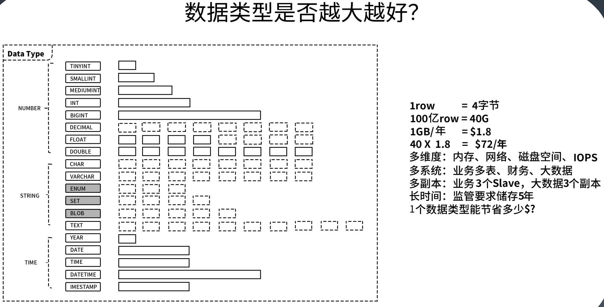
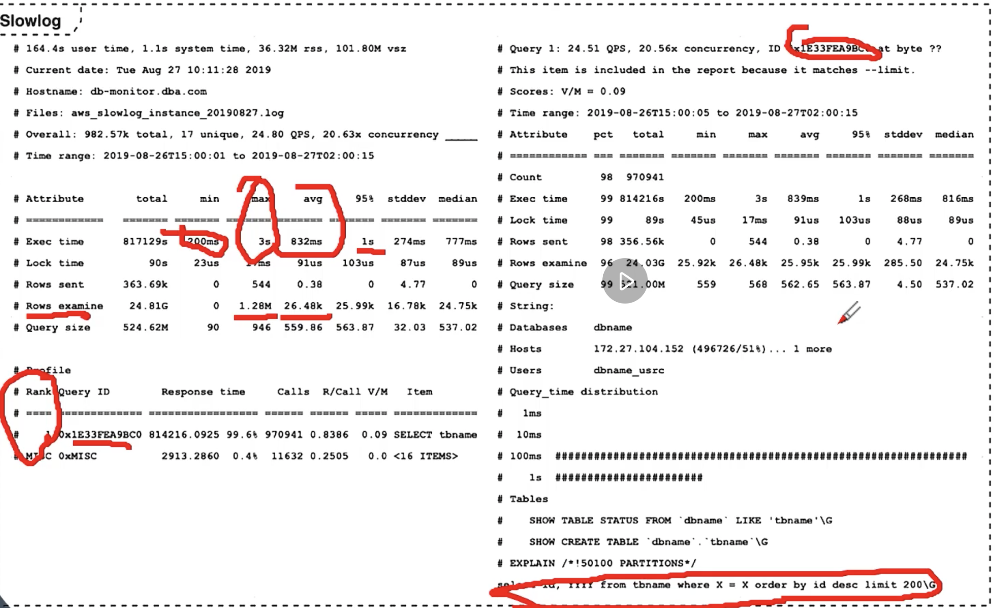

## 配置优化

```sql
 show variables like '%dir%';
 show global variables like '%dir%';
 
 mysql> show variables like '%last%';
+----------------+-------+
| Variable_name  | Value |
+----------------+-------+
| last_insert_id | 0     |
+----------------+-------+
1 row in set (0.00 sec)

mysql> select  @@last_insert_id;
+------------------+
| @@last_insert_id |
+------------------+
|                0 |
+------------------+
1 row in set (0.00 sec)
  
```

### 配置文件

my.cnf 文件 // my.ini 

[mysqld] 

server 

[mysql] 

client

主要配置 server参数。


### 连接请求的变量

**max_connections** 

```sql
mysql> show global variables like '%connection%';

mysql> set global max_connections=10000;
```

默认151，比较小。


##### back_log 

决定了半连接状态的连接

**wait_timeout**和**interative_timeout**

无访问的话断开连接，默认28800s 8个小时。


#### 缓冲区变量

**key_buffer_size**，innodb不用，myISAM 索引的buffer，影响索引操作速度。


**query_cache_size**，查询缓存大小，简称 QC

- 缓存有两种一种在引擎中，一种在server层叫做cache，这里指的是server层的缓存

- 8.0去掉了server 缓存（失效概率大，外部的分布式缓存很多，去掉后mysql自身变得简洁），此配置也没有了

  

**max_connect_errors**，连接最大错误数

**sort_buffer_size**=1M，排序buffer大小，默认1M，如果空间不够用会塞到临时文件中，做归并排序。

**join_buffer_size**=2M，连接buffer。

**max_allowed_packet**=32M，给server发送的最大数据包大小。

- 批量insert太大执行失败

**thread_cache_size**=300，每个线程可用cache大小。


#### 配置innodb的变量

**innodb_buffer_pool_size**=128M 

- 众多innodb参数中最重要的一个，innodb 内存buffer的大小
- key查询的各种缓存用的都是这个区域

innodb_flush_log_at_trx_commit ，刷日志

innodb_thread_concurrency=0 

innodb_log_buffer_size 

innodb_log_file_size=50M 

innodb_log_files_in_group=3 

**读取数据时的buffer大小**

read_buffer_size=1M 

read_rnd_buffer_size=16M  随机读

bulk_insert_buffer_size=64M 批量插入

binary log


## 数据库设计优化实践

### 选择引擎

- 不需要强事务，比如动态渲染网站等用MyISAM
- 强事务，金融 交易 电商用innodb
- 内存临时建表，需要快同时不需要持久化，可以使用memory
- 数据都是归档可以使用archive/toku（压缩效率非常高）

### 库表命名

- 不要使用拼音，使用有意义的词

- 用前缀表示不同的模块
- 库表里字段的名字可以转用业务意义的名字，可以加一个类型前缀比如f_表示float

### 合理拆分宽表

表200-300个字段，查询效率特别低，使用类似范式的方式做拆分，分为一个主表和子表


### 选择数据类型：明确、尽量小

- char、varchar 的选择
- （text/blob/clob）的使用问题
  - 性能会下降一个数量级，不建议用
  - blob/clob通常不和其他列一起插入，单独用update方式输入进去
- 文件、图片不要存入到数据库，数据库存放路径/url
- 时间日期的存储问题
  - 通常可以用应用时间戳
  - 严格要求一致应使用数据库时间戳
  - 可以用数字long存时间，解决很多问题，缺点是不直观
- 数值的精度问题
  - 对有高精度要求的数字用字符串表示
  - int(3) 和int(8) 创建表结构时有什么区别，没有任何区别


### 尽量不要使用外键和触发器


### 唯一约束和索引的关系

唯一约束一般会自动生成索引


### 适当的冗余字段是有利的

为了更高的效率，少连一个表等，多存储一些数据是值得的。


### 不建议使用游标、变量、视图、自定义函数、存储过程

很难移植。使用自定义函数实现业务逻辑，是让数据库干了不擅长做的事情。


### 自增主键的使用问题

数据量不大建议使用。

分布式场景，分库分表就不适用。


### 能够在线修改表结构（DDL 操作）

锁表，尽量不要做。


### 逻辑删除还是物理删除

只做逻辑删除。

### 要不要加 create_time,update_time 时间戳

给关键的表全加。数据更新跟踪，数据迁移使用。


### 数据库碎片问题

类似JVM GC。会锁表

### 如何快速导入导出、备份数据

导出：

1. 查出来，为了避免对不齐，可能需要锁表
2. 摘从库
3. 读binlog

导入

1. 批量insert
2. load data

通常先把表里的索引和约束都删掉，导入后重建。


### 怎么实现主键 ID

#### 自增主键

优点很多，但是做分库分表，子库没办法用。无法做到全局唯一

#### sequence

多个表可以使用同一个sequence，相当于一个atomic。

- mysql没有sequence，可以diy
  - 在数据库创建一张表 ，三列，sequence name，值，步长
  - select for update，锁表得到值把步长加一再提交
  - 步长的意义是，相当于应用可以取一段，这一段都被拿去使用，提高性能

早期互联网使用这种方式。缺点除了步长没有使用导致不连续外，竞争对手还可能通过sequence判断你的数据规模，泄漏商业机密

#### UUID

一个很大的数，降低重复的概率，缺点是比较占空间

#### 时间戳随机数

增加时间戳，使用随机数还是有可能重复

### snowflake

时间戳随机数的改进

机器+时间戳+自增数字

目前基本都使用这种方法。

### 高效分页

count pageSize pageNum 页面展示分页很常见

可以使用分页插件，自动帮我们（封装sql）做页数的判断和分页

- 问题是连了很多表，count(*)可能很慢，实际改写一下只查主表可能就可以

大数量级分页可能会有问题

- 反序
- 技术角度：带id。使用下一页时，利用当前页的id
- 需求角度：非精确分页 数量大的情况下，精确分页意义不大


### 手工乐观锁

select * from xxx for update 

update xxx 

commit；


select * from xxx 

update xxx where value=oldValue 


为什么叫乐观锁

## SQL优化

如何发现需要优化的sql 有哪些方法  有哪些好处

### 数据类型




### 存储引擎

**InnoDB** 

1. 聚集索引 
2. 锁粒度是行锁 
3. InnoDB 支持事务 

没有其他特别因素就用 InnoDB

**ToKuDB**

1. 高压缩比，尤其适用于压缩和归档（1:12）
2. 在线添加索引，不影响读写操作
3. 支持完整的 ACID 特性和事务机制
   归档库


### 避免隐式转换

where 条件中注意数据类型，避免类型转换。

有时是用错类型，数值类型和字符类型间，mysql会自己做隐式转换，转换为字符型

- 导致错误，以及索引失效
- show warnnings


### 如何定位问题

#### 慢查日志 slow query



#### 应用和运维的监控

监控三要素

1. 采集间隔
2. 指标计算方法 最大最小平均 95%
3. 数据来源


### 写入优化


#### PreparedStatement 减少 SQL 解析 

发送一次sql语句，使用？占位符

后续发送多次参数

sql的解析成本就能够降低

#### Multiple Values/Add Batch 减少交互 

insert 语句拼多行记录，prepare statement增加batch

注意这个大sql不能超过max package

#### Load Data，直接导入 

文本文件 每行一条数据

#### 索引和约束问题

先删除索引和约束。


### 数据更新优化

尽量不要使用范围，使用范围更新尽量要缩小在一定的范围上，越精确越好

注意gap lock的问题


### 模糊查询

like的问题，默认只走前缀匹配，如果是 %在前则无法使用索引，会走全表扫描。

对一个字符型的数据类型，不走索引走全局扫描可能非常的慢。

解决办法是

1. 使用msql里带的全文检索，建立全文检索的倒排索引
2. 更建议使用solr/ES，尤其是每个列都可能需要模糊查询快速查询出来，不要在业务数据库做。

### 连接查询

驱动表的选择

避免笛卡尔积


### 索引失效汇总

NULL，not，not in，函数

减少使用or，可以用union，以及like

- or和前面所有精确的索引都没有关系，完全破坏
- union会去重，union all不会

大数据量下，放弃所有条件组合都走索引的幻想，用全文索引（es）

必要时使用force index强制查询走某个索引


### sql设计优化

查询数据量和查询次数的平衡

避免不必须的大量重复数据传输

避免临时文件排序或者临时表

- 尽量使用临时性的东西

分析类需求，可以使用汇总表


