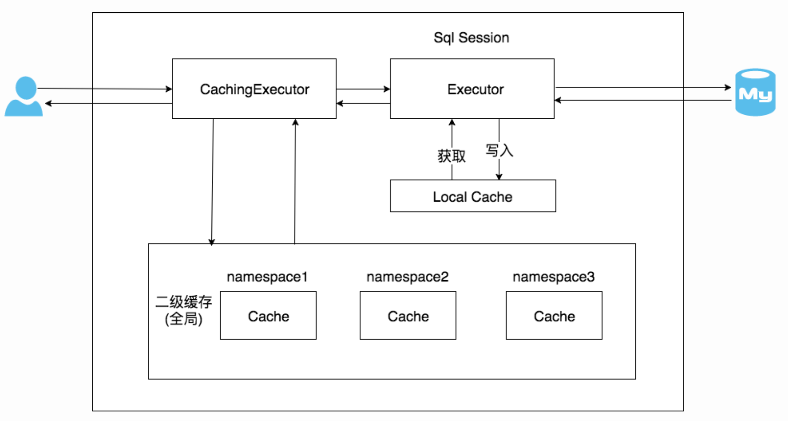

**1.（选做）**按照课程内容，动手验证 Hibernate 和 Mybatis 缓存。

workspace ： 08cache/cache


## MyBatis 缓存

### 一级缓存

在应用运行过程中，我们有可能在一次数据库会话中，执行多次查询条件完全相同的SQL，MyBatis提供了一级缓存的方案优化这部分场景，如果是相同的SQL语句，会优先命中一级缓存，避免直接对数据库进行查询，提高性能。

每个SqlSession中持有了Executor，每个Executor中有一个LocalCache。当用户发起查询时，MyBatis根据当前执行的语句生成`MappedStatement`，在Local Cache进行查询，如果缓存命中的话，直接返回结果给用户，如果缓存没有命中的话，查询数据库，结果写入`Local Cache`，最后返回结果给用户。


出现`insert/delete/update`方法，缓存会刷新。

一级缓存只在数据库会话内部共享。 如果另外一个会话修改了数据，可能会造成脏读。。

#### 总结

1. MyBatis一级缓存的生命周期和SqlSession一致。

   - 默认是`SESSION`级别，即在一个MyBatis会话中执行的所有语句，都会共享这一个缓存。另一种是`STATEMENT`级别，可以理解为缓存只对当前执行的这一个`Statement`有效。

   - `<setting name="localCacheScope" value="SESSION"/>`

2. MyBatis一级缓存内部设计简单，只是一个没有容量限定的HashMap，在缓存的功能性上有所欠缺。

3. MyBatis的一级缓存最大范围是SqlSession内部，有多个SqlSession或者分布式的环境下，数据库写操作会引起脏数据，建议设定缓存级别为Statement。


#### 实践

disable spring cache，enable mybatis cache

```less
2021-07-26 19:45:26.319 DEBUG 52356 --- [nio-8080-exec-1] i.kimmking.cache.mapper.UserMapper.find  : ==>  Preparing: select * from user where id = ?
2021-07-26 19:45:26.341 DEBUG 52356 --- [nio-8080-exec-1] i.kimmking.cache.mapper.UserMapper.find  : ==> Parameters: 3(Integer)
2021-07-26 19:45:26.353 DEBUG 52356 --- [nio-8080-exec-1] i.kimmking.cache.mapper.UserMapper.find  : <==      Total: 1
 ==> find 3
2021-07-26 19:46:22.806 DEBUG 52356 --- [nio-8080-exec-2] io.kimmking.cache.mapper.UserMapper      : Cache Hit Ratio [io.kimmking.cache.mapper.UserMapper]: 0.5
 ==> find 3
2021-07-26 19:46:23.466 DEBUG 52356 --- [nio-8080-exec-4] io.kimmking.cache.mapper.UserMapper      : Cache Hit Ratio [io.kimmking.cache.mapper.UserMapper]: 0.6666666666666666
 ==> find 3
2021-07-26 19:46:31.057 DEBUG 52356 --- [nio-8080-exec-6] io.kimmking.cache.mapper.UserMapper      : Cache Hit Ratio [io.kimmking.cache.mapper.UserMapper]: 0.75
 ==> find 3
2021-07-26 19:46:31.707 DEBUG 52356 --- [nio-8080-exec-8] io.kimmking.cache.mapper.UserMapper      : Cache Hit Ratio [io.kimmking.cache.mapper.UserMapper]: 0.8
```


### 二级缓存

一级缓存中，其最大的共享范围就是一个SqlSession内部，如果多个SqlSession之间需要共享缓存，则需要使用到二级缓存。开启二级缓存后，会使用CachingExecutor装饰Executor，进入一级缓存的查询流程前，先在CachingExecutor进行二级缓存的查询



二级缓存开启后，同一个namespace下的所有操作语句，都影响着同一个Cache，即二级缓存被多个SqlSession共享，是一个全局的变量。

MyBatis的二级缓存不适应用于映射文件中存在多表查询的情况，通常我们会为每个单表创建单独的映射文件，由于MyBatis的二级缓存是基于`namespace`的，多表查询语句所在的`namspace`无法感应到其他`namespace`中的语句对多表查询中涉及的表进行的修改，引发脏数据问题。

#### 总结

1. MyBatis的二级缓存相对于一级缓存来说，实现了`SqlSession`之间缓存数据的共享，同时粒度更加的细，能够到`namespace`级别，通过Cache接口实现类不同的组合，对Cache的可控性也更强。
2. MyBatis在多表查询时，极大可能会出现脏数据，有设计上的缺陷，安全使用二级缓存的条件比较苛刻。
3. 在分布式环境下，由于默认的MyBatis Cache实现都是基于本地的，分布式环境下必然会出现读取到脏数据，需要使用集中式缓存将MyBatis的Cache接口实现，有一定的开发成本，直接使用Redis、Memcached等分布式缓存可能成本更低，安全性也更高。
   - 建议MyBatis缓存特性在生产环境中进行关闭，单纯作为一个ORM框架使用可能更为合适。


### 其他问题


### 处理result为null的问题

```shell
➜  java curl 'http://localhost:8080/user/find?id=5'
{"timestamp":"2021-07-26T10:12:32.921+0000","status":500,"error":"Internal Server Error","message":"Cache 'userCache' does not allow 'null' values. Avoid storing null via '@Cacheable(unless=\"#result == null\")' or configure RedisCache to allow 'null' via RedisCacheConfiguration.","path":"/user/find"}%
```


```java
@Cacheable(key="#id",value="userCache",unless="#result == null")
public User find(int id) {
    System.out.println(" ==> find " + id);
    return userMapper.find(id);
}
```


#### mybatis日志输出

修改日志输出级别至debug

```yaml
logging:
  level:
    io:
      kimmking:
        cache : debug
```


#### Warning about SSL connection when connecting to MySQL database

```less
Mon Jul 26 19:30:06 CST 2021 WARN: Establishing SSL connection without server's identity verification is not recommended. According to MySQL 5.5.45+, 5.6.26+ and 5.7.6+ requirements SSL connection must be established by default if explicit option isn't set. For compliance with existing applications not using SSL the verifyServerCertificate property is set to 'false'. You need either to explicitly disable SSL by setting useSSL=false, or set useSSL=true and provide truststore for server certificate verification.
```


修改配置

```
url: jdbc:mysql://localhost:3306/test?useUnicode=true&characterEncoding=utf-8&serverTimezone=UTC&useSSL=false
```


### 参考

https://tech.meituan.com/2018/01/19/mybatis-cache.html