列举常用的并发操作 API 和工具类，简单分析其使用场景和优缺点。


## 0 JUC

常用并发操作API和工具类主要集中在java.util.concurrent 包中，共分5类

1. 锁机制类 **Locks** : 

Lock, Condition, ReentrantLock, ReadWriteLock,LockSupport

2. 原子操作类 **Atomic** : 

AtomicInteger, AtomicLong, LongAdder

3. 线程池相关类 **Executor** :

Future, Callable, Executor, ExecutorService

4. **信号量三组工具类** Tools : 

CountDownLatch, CyclicBarrier, Semaphore

5. **并发集合类 Collections** : 

CopyOnWriteArrayList, ConcurrentMap


## 1 Locks

### 使用场景 为什么需要显式的 Lock

锁可以看作是对某一块资源的标记，谁拿到锁谁就有权利操作。synchronized 可以给代码块加锁， 其他线程来就被阻塞，wait/notify 可以看做加锁和解锁。 那为什么还需要一个显式的锁呢?

synchronized 方式的问题：

1. 同步块的阻塞**无法中断**
2. 同步块的阻塞**无法控制超时**（无法自动解锁，系统被挂死）
3. 同步块**无法异步处理锁**（即不能立即知道是否可以拿到锁）
4. 同步块**无法根据条件灵活的加锁解锁**（即只能跟同步块范围一致）

### 更自由的锁 Lock

java.util.concurrent.locks子包内的Lock接口

1. 使用方式灵活可控
2. 性能开销小
3. 锁工具包: java.util.concurrent.locks

对应解决上面的几个问题，Lock 接口设计：

```java
// 1.支持中断的 API
void lockInterruptibly() throws InterruptedException;
// 2.支持超时的 API
boolean tryLock(long time, TimeUnit unit) throws InterruptedException;
// 3.支持非阻塞获取锁的 API
boolean tryLock();
```

简单场景下，相比使用synchronized 不一定谁的性能更好，性能瓶颈并不一定在锁上，和代码逻辑本身可能也有很大的关系。


#### 其他基础接口

```java
void lock(); // 获取锁; 类比 synchronized (lock)
void lockInterruptibly() throws InterruptedException; // 获取允许打断的锁; 
boolean tryLock(long time, TimeUnit unit) throws InterruptedException; // 尝试获取锁; 成功则返回 true; 超时则退出
boolean tryLock(); // 尝试【无等待】获取锁; 成功则返回 true
void unlock(); // 解锁；要求当前线程已获得锁; 类比同步块结束；可以主动调用，显然比依靠同步块更灵活

Condition newCondition();
// 新增一个绑定到当前Lock的条件
// 一个锁可以new出不同的condition，可以把它看作一个钥匙、信号，把一把大锁分解成多个子锁
// 类比: Object monitor
final Lock lock = new ReentrantLock();
final Condition notFull = lock.newCondition();
final Condition notEmpty = lock.newCondition();
```


### ReentrantLock

最基础的实现类ReentrantLock

JDK 1.5新增的类，实现了Lock接口，作用与synchronized关键字相当，但比synchronized更加灵活。

- 支持重入
- 同时支持公平锁与非公平锁，非公平效率高，公平更注重时间先后

ReetrantLock锁在使用上还是比较简单，内部实现基于AQS并发框架

1. lock更灵活，可以自由定义多把锁的加锁解锁顺序（synchronized要按照先加的后解顺序）

2. 提供多种加锁方案，lock 阻塞式, trylock 无阻塞式, lockInterruptily 可打断式， 还有trylock的带超时时间版本。

3. 本质上和监视器锁即synchronized是一样的

4. 能力越大，责任越大，必须控制好加锁和解锁

   

```java
public class LockCounter {
  private int sum = 0;
  // 可重入锁+公平锁
  private Lock lock = new ReentrantLock(true); // 公平锁
    public int addAndGet() {
    try {
      lock.lock();
      return ++sum;
    } finally {
      lock.unlock();
    }
  }
  public int getSum() {
    return sum;
  }
}
```


```java
// 测试代码
public static void testLockCounter() {
  int loopNum = 100_0000;
  LockCounter counter = new LockCounter();
  IntStream.range(0, loopNum).parallel()
  .forEach(i -> counter.incrAndGet());
}
```


### 读写锁 ReentrantReadWriteLock

ReadWriteLock 管理一组锁，一个读锁，一个写锁。

读锁可以在没有写锁的时候被多个线程同时持有（共享的），写锁是独占的（排他的）。

- 读锁未释放，写锁不能写

所有读写锁的实现必须确保写操作对读操作的内存影响。每次只能有一个写线程，但是同时可以有多个线程并发地读数据

ReadWriteLock 适用于**读多写少**的并发情况。

```java
Lock readLock(); // 获取读锁; 共享锁
Lock writeLock(); // 获取写锁; 独占锁(也排斥读锁)
// 构造方法
public ReentrantReadWriteLock(boolean fair) {
  sync = fair ? new FairSync() : new NonfairSync();
  readerLock = new ReadLock(this);
  writerLock = new WriteLock(this);
}
```


```java
public class ReadWriteLockCounter {
  private int sum = 0;
  private ReadWriteLock lock = new ReentrantReadWriteLock(true); // 公平锁
  public int incrAndGet() {
    try {
      lock.writeLock().lock(); // 写锁; 独占; 被读锁排斥
      return ++sum;
    } finally {
    	lock.writeLock().unlock();
    } 
  }
  public int getSum() {
    try {
      lock.readLock().lock(); // 读锁; 共享锁; 保证可见性
      return ++sum;
    } finally {
      lock.readLock().unlock();
    }
  } 
}
```


### Condition

通过 Lock.newCondition() 创建。 

可以看做是 Lock 对象上的信号。类似于 wait/notify。

```java
// 4种await
void await() throws InterruptedException; // 等待信号; 类比 Object#wait()
void awaitUninterruptibly(); // 等待信号; 
boolean await(long time, TimeUnit unit) throws InterruptedException; // 等待信号; 超时则返回 false
boolean awaitUntil(Date deadline) throws InterruptedException; // 等待信号; 超时则返回 false


void signal(); // 给一个等待线程发送唤醒信号; 类比Object#notify ()
void signalAll();  // 给所有等待线程发送唤醒信号; 类比 Object#notifyAll()
```


### LockSupport 锁当前线程

LockSupport 类似于 Thread 工具类提供很多静态方法，专门处理（执行这个代码的）本线程的。 

```java
// 前三个可以传递进入一个锁对象，使用对象作为锁的持有者
public static void park(Object blocker) //暂停当前进程
public static void parkNanos(Object blocker, long nanos) // 暂停当前进程，有超时时间限制
public static void parkUntil(Object blocker, long deadline) // 暂停当前进程，直到某个时间

public static void park() // 无限期暂停当前线程
public static void parkNanos(long nanos) //暂停当前进程，有超时时间限制
public static void parkUntil(long deadline) // 恢复当前线程，直到某个时间
public static void unPark(Thread thread) // 恢复被park暂停的线程；线程是无法unpark自己的
public static Object getBlocker(Threat t) 
```


### 用锁的最佳实践

Doug Lea《Java 并发编程：设计原则与模式》一书中，
推荐的三个用锁的最佳实践，它们分别是：

1. 永远只在更新对象的成员变量时加锁
2. 永远只在访问可变的成员变量时加锁
3. 永远不在调用其他对象的方法时加锁


最小使用锁：

1. 降低锁范围：锁定代码的范围/作用域
2. 细分锁粒度：将一个大锁，拆分成多个小锁


## 2 原子操作类Atomic

### 使用场景

使用同步处理，是通过加锁使得可能存在冲突的操作单线程执行来避免问题，**线程并不能真的并行**。

原子类可以让应用在保证线程安全、正确性的前提下，充分利用多线程能力。

- 使用前面讲过的无锁技术
  - Unsafe API 中有一系列的方法 native的 CompareAndSwap
  - JVM 调用CPU 硬件指令 - CAS 指令 
  - Value 的可见性 - volatile 关键字

### **核心实现原理**

1. volatile 保证读写操作都可见（注意不保证原子性）

2. 使用 CAS 指令，作为乐观锁实现，通过自旋重试保证写入


### 锁与无锁

什么情况下有锁好、什么情况下无锁好 

并发压力跟锁性能的关系：

1. 压力非常小，性能本身要求就不高；
2. 压力一般的情况下，无锁更快，大部分都一次写入；
3. 压力非常大时，自旋导致重试过多，资源消耗很大。

一种说法是读操作较多时适合使用乐观锁，写操作多时使用悲观锁。


数据库事务锁、分布式也大量用到乐观锁


### 分段思想进一步改进

LongAdder 对 AtomicLong 的改进

1、AtomicInteger 和 AtomicLong 里的 value 是所有 线程竞争读写的热点数据； 

2、将单个 value 拆分成跟线程一样多的数组 Cell[]； 

3、每个线程写自己的 Cell[i]++，最后对数组求和。


多路归并的思想： 

- 快排 
- G1 GC 
- ConcurrentHashMap


加里程碑也是分段思想的体现


## 3 线程池相关类 Executor

### 为什么用线程池

线程池（Thread Pool）是一种基于池化（Pooling）思想管理线程的工具。

线程数据比较重量级的资源。

- 线程过多会带来额外的开销，其中包括创建销毁线程的开销、调度线程的开销等等，降低了计算机的整体性能。
- 对于重量级资源，倾向于用维护一个资源池的方式使用


线程池维护多个线程，等待监督管理者分配可并发执行的任务。这种做法，一方面避免了处理任务时创建销毁线程开销的代价，另一方面避免了线程数量膨胀导致的过分调度问题，保证了对内核的充分利用。

- **降低资源消耗**：通过池化技术重复利用已创建的线程，降低线程创建和销毁造成的损耗。
- **提高响应速度**：任务到达时，无需等待线程创建即可立即执行。
- **提高线程的可管理性**：线程是稀缺资源，如果无限制创建，不仅会消耗系统资源，还会因为线程的不合理分布导致资源调度失衡，降低系统的稳定性。使用线程池可以进行统一的分配、调优和监控。
- **提供更多更强大的功能**：线程池具备可拓展性，允许开发人员向其中增加更多的功能。比如延时定时线程池ScheduledThreadPoolExecutor，就允许任务延期执行或定期执行。


核心问题就是资源管理问题，最大化收益并最小化风险。


### ThreadPoolExecutor

#### 总体设计

通用的线程池除了各种资源的设置，还需要管理峰值下的任务处理机制，其抽象实现有一定的复杂度。JDK已经做好了抽象线程池的定义及实现。

1. Excutor: 执行者，顶层抽象接口
2. ExcutorService: 接口 API
3. ThreadFactory: 线程工厂，配置executor参数
4. ThreadPoolExecutor 最常用
5. Excutors: 工具类，很多静态方法，帮助创建常用的线程池类型


Java中的线程池核心实现类是ThreadPoolExecutor。

Executor -> ExecutorService-> AbstractExecutorService -> ThreadPoolExecutor 

顶层接口是Executor，提供了一种思想：将任务提交和任务执行进行解耦。

- 线程池在内部实际上构建了一个生产者消费者模型，将线程和任务两者解耦，并不直接关联，从而良好的缓冲任务，复用线程。


#### Executor – 执行者


```java
void execute(Runnable command); 执行可运行的任务
```


线程池从功能上看，它就是一个任务执行器

#### ExecutorService

submit 方法 -> 有返回值，用 Future 封装
execute 方法 -> 无返回值

submit 方法还异常可以在主线程中 get 捕获到

execute 方法执行任务是捕捉不到异常的


shutdown()：停止接收新任务，原来的任务继续执行。

- 更graceful

shutdownNow()：停止接收新任务，原来的任务停止执行

boolean awaitTermination(timeOut, unit)：阻塞当前线程，返回是否线程都执行完


如果shutdown一直无法完成，应该如何处理？一种更好的停止策略

- awaitTermination 一定时间，等待所有线程全部完成
- 到时后根据返回值判断是否所有的线程都停止
- 如果没有可以调用shutdownNow停止运行时间过长的线程
  - 一般这时业务角度已经超时

#### ThreadPoolExecutor

线程池的实现类。

An ExecutorService that executes each **submitted task** using one of possibly several pooled threads, normally **configured using Executors factory methods**.


Thread pools address two different problems: 

1. they usually provide improved performance when executing large numbers of asynchronous tasks, due to **reduced per-task invocation** overhead
2. and they provide a means of **bounding and managing the resources**, including threads, consumed when executing a collection of tasks. 

Each ThreadPoolExecutor also maintains some basic statistics, such as the number of completed tasks.


```java
private final class Worker extends AbstractQueuedSynchronizer implements Runnable
  
```


##### ctl

The main pool control state, ctl, is an atomic integer packing two conceptual fields

- workerCount, indicating the effective number of threads
- runState,    indicating whether running, shutting down etc

把一个 int 变量拆成两部分来用。前面3位用来表示状态，后面29位用来表示工作线程数量


```java
private final AtomicInteger ctl = new AtomicInteger(ctlOf(RUNNING, 0));

private static final int COUNT_BITS = Integer.SIZE - 3;      // 29
private static final int CAPACITY   = (1 << COUNT_BITS) - 1; // 00011111 ... ... 11111111

// 状态在高位存储
private static final int RUNNING    = -1 << COUNT_BITS;      // 11100000 ... ... 00000000
private static final int SHUTDOWN   =  0 << COUNT_BITS;      // 00000000 ... ... 00000000
private static final int STOP       =  1 << COUNT_BITS;      // 00100000 ... ... 00000000
private static final int TIDYING    =  2 << COUNT_BITS;      // 01000000 ... ... 00000000
private static final int TERMINATED =  3 << COUNT_BITS;      // 01100000 ... ... 00000000

private static int ctlOf(int rs, int wc) { return rs | wc; }


private static final int CAPACITY   = (1 << COUNT_BITS) - 1;

// CAPACITY 的值是00011111 ... … 11111111
// 按位与之后去掉了前面三位，保留了后面的。所以拿到的就是工作线程的数量。
private static int workerCountOf(int c) { 
    return c & CAPACITY; 
}

//直接拿 ctl 的值和 SHUTDOWN 作比较。
private static boolean isRunning(int c) {
    return c < SHUTDOWN;
}
```

要先知道在 RUNNING 状态下，ctl 的值是什么样的。初始状态，ctl 的值是11100000 ... … 00000000，表示 RUNNING 状态，和0个工作线程。后面，每创建一个新线程，都把 ctl 加一。当有5个工作线程时，ctl 的值是11100000 ... … 00000101。在 RUNNING 状态下，ctl 始终是**负值**，而 SHUTDOWN 是0，所以可以通过直接比较 ctl 的值来确定状态。


使用一个原子变量存储两个值，可以在多线程环境下保证线程安全。（个人觉得这里效率到并不是关键）


##### execute

```java
public void execute(Runnable command) {
        if (command == null)
            throw new NullPointerException();
        /*
         * Proceed in 3 steps:
         */
        int c = ctl.get();
  			/**
       * 1. If fewer than corePoolSize threads are running, try to
         * start a new thread with the given command as its first
         * task.  The call to addWorker atomically checks runState and
         * workerCount, and so prevents false alarms that would add
         * threads when it shouldn't, by returning false.
         * 当前线程数小于poolsize 直接启动一个新线程执行任务
         */
        if (workerCountOf(c) < corePoolSize) {
            if (addWorker(command, true))
                return;
            c = ctl.get();
        }
  			/**         
  			* 2. If a task can be successfully queued, then we still need
         * to double-check whether we should have added a thread
         * (because existing ones died since last checking) or that
         * the pool shut down since entry into this method. So we
         * recheck state and if necessary roll back the enqueuing if
         * stopped, or start a new thread if there are none.
         * 运行到这里说明线程数和pool size一致了，这时要扔工作队列去等待
         */
        if (isRunning(c) && workQueue.offer(command)) {
            int recheck = ctl.get();
            if (! isRunning(recheck) && remove(command))
                reject(command);
            else if (workerCountOf(recheck) == 0)
                addWorker(null, false);
        }
  			/**
  			 * 3. If we cannot queue task, then we try to add a new
         * thread.  If it fails, we know we are shut down or saturated
         * and so reject the task.
         * 如果达到了最大线程数
         */
        else if (!addWorker(command, false))
            reject(command);
    }
```


ThreadPoolExecutor 提交任务逻辑:

1. 判断 corePoolSize 【创建】
2. 加入 workQueue
3. 判断 maximumPoolSize 
4. 执行拒绝策略处理器


##### 重要属性及方法

```java
int corePoolSize; // 核心线程数
int maximumPoolSize; // 最大

ThreadFactroy threadFactory; // 线程创建队列
BlockingQueue<Runnable> workQueue; // 工作队列
RejectExecutionHandler handler; //
void execute(Runnable command); // 执行任务 异步

// 带返回值的 提交任务
Future<?> submit(Runnable task);
submit(Runnable task,T result);
submit(Callable<T> task);
```


#### ThreadFactory


### 线程池参数

#### 缓冲队列

BlockingQueue 是双缓冲队列。BlockingQueue 允许两个线程同时向队列一个存储，一个取出操作。在保证并发安全的同时，提高了队列的存取效率。四个实现类：

**FIFO 顺序排列**

1. ArrayBlockingQueue：规定大小的 BlockingQueue，**其构造必须指定大小**。。
2. LinkedBlockingQueue：**大小不固定**的 BlockingQueue，若其构造时指定大小，生成的BlockingQueue 有大小限制，不指定大小，其大小有 Integer.MAX_VALUE 来决定（可能导致堆内存溢出）。

超出指定大小时，会block新对象进入。

**非FIFO顺序排列**

1. PriorityBlockingQueue：类似于 LinkedBlockingQueue，依据对象的**自然顺序**或者构造函数的 **Comparator** 决定。
2. SynchronizedQueue：特殊的 BlockingQueue，对其的操作必须是**放和取交替**完成。

#### 拒绝策略

1. ThreadPoolExecutor.**AbortPolicy**: 丢弃任务并抛出 RejectedExecutionException异常
   - 默认拒绝策略
   - 抛出异常进行处理/记录
2. ThreadPoolExecutor.DiscardPolicy：丢弃任务，但是不抛出异常
3. ThreadPoolExecutor.DiscardOldestPolicy：丢弃队列最前面的任务，然后重新提交被拒绝
   的任务
4. ThreadPoolExecutor.**CallerRunsPolicy**：由调用线程（提交任务的线程）处理该任务
   - 目前用的比较多


### 创建线程池方法

使用工厂批量创建。

1. newSingleThreadExecutor
   创建一个**单线程的线程池**。这个线程池只有一个线程在工作，也就是相当于单线程串行执行所有任务。如果这个唯一的
     线程因为异常结束，那么会有一个新的线程来替代它。

  - 此线程池保证所有任务的执行顺序按照任务的提交顺序

2. newFixedThreadPool
   创建固定大小的线程池。每次提交一个任务就创建一个线程，直到线程达到线程池的最大大小。线程池的大小一旦达到
     最大值就会保持不变，如果某个线程因为执行异常而结束，那么线程池会补充一个新线程。
3. newCachedThreadPool
   创建一个可缓存的线程池。如果线程池的大小超过了处理任务所需要的线程，那么就会回收部分空闲（60秒不执行任务）的线程，当任务数增加时，此线程池又可以智能的添加新线程来处理任务。
   - 此线程池不会对线程池大小做限制，线程池大小完全依赖于操作系统（或者说JVM）能够创建的最大线程大小
4. newScheduledThreadPool
   创建一个大小无限的线程池，此线程池支持定时以及周期性执行任务的需求。
   - 不是立马执行，指定一个时间。


#### 创建固定线程池的经验

不是越大越好，太小肯定也不好，假设核心数为 N

1. 如果是 CPU 密集型应用，则线程池大小设置为 N 或 N+1
2. 如果是 IO 密集型应用，则线程池大小设置为 2N 或 2N+2

IO比例越大相对线程数可以设置越大。


### Callable – 基础接口

Runnable#run() 没有返回值，希望通过额外的线程去执行任务，把返回值带回来给我门，就需要使用callable。

- Callable#call()方法有返回值


### Future – 基础接口

Future接口对应一个异步执行的任务，最终拿到返回值。

```java
public interface Future<V> {
    
	boolean cancel(boolean mayInterrupt) // 取消任务
  // Waits if necessary for the computation to complete, and then retrieves its result.
	V get();
  // Waits if necessary for at most the given time for the computation to complete, and then retrieves its result, if available.
  // timeout – the maximum time to wait
  V get(long timeout, TimeUnit unit)
```


#### CompletableFuture

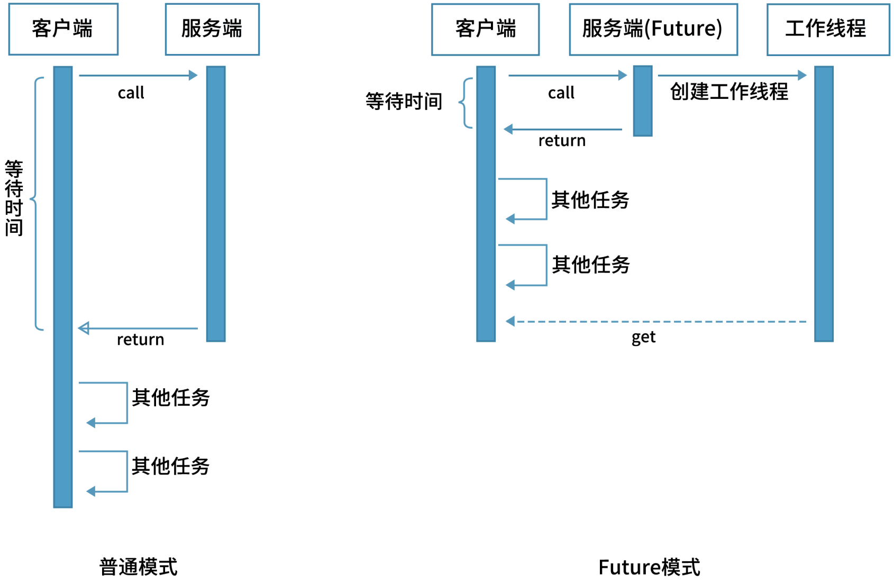

Future/ FutureTask 单个线程/任务的执行结果

CompletableFuture 异步，回调，组合


## 4 **信号量三组工具类** Tools

### 基础组件AQS

AbstractQueuedSynchronizer，即队列同步器。它是构建锁或者其他同步组件的基础。是 JUC 并发包中的最核心基础组件，抽象了竞争的资源和线程队列。

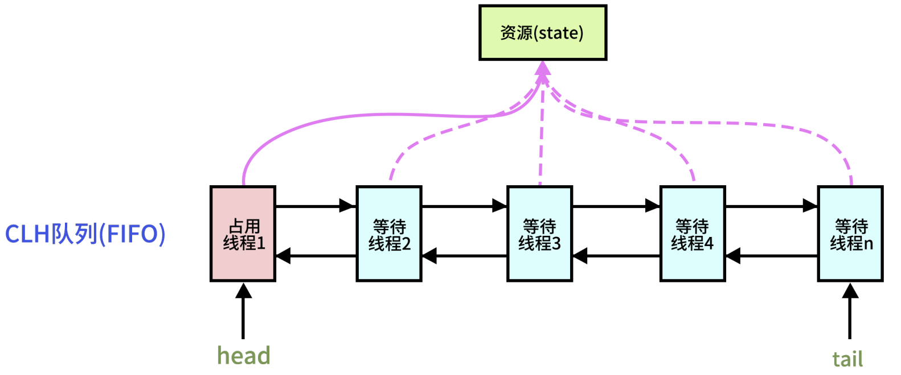

多个线程等待某个资源，内部通过一个int类型的成员变量state来控制同步状态，加volatile对多个线程都可见

- 当state=0时，则说明没有任何线程占有共享资源的锁
- 当state=1时，则说明有线程目前正在使用共享变量，其他线程必须加入同步队列进行等待


通过内部类Node构成的FIFO的**同步队列**来完成线程获取锁的排队工作。


通过内部类ConditionObject构建**等待队列**，

- 当Condition调用wait()方法后，线程将会加入**等待队列**中，
- 当Condition调用signal()方法后，线程将从**等待队列**转移到**同步队列**中进行锁竞争。


这里涉及到两种队列，一种的同步队列，当线程请求锁而等待后将加入同步队列等待，而另一种则是等待队列(可有多个)，通过Condition调用await()方法释放锁后，将加入等待队列。


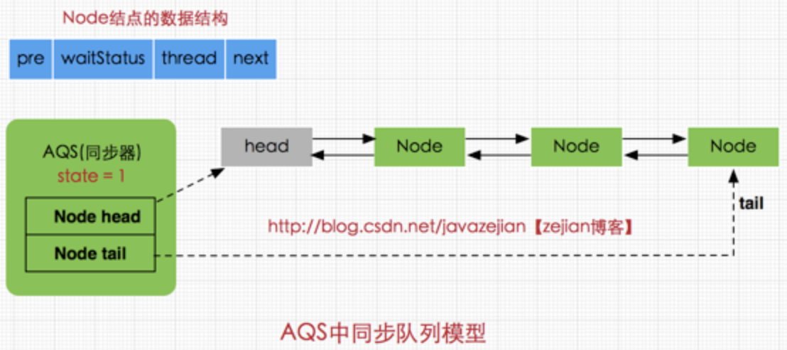

head和tail分别是AQS中的变量，其中head为空结点不存储信息指向同步队列的头部，tail是同步队列的队尾，同步队列采用的是双向链表的结构这样可方便队列进行结点增删操作。

state变量代表同步状态，当线程调用lock方法进行加锁后，如果此时state的值为0，则说明可以获取到锁(这里锁和同步状态代表同一个意思)，同时将state设置为1表示获取成功。如果state已为1，也就是当前锁已被其他线程持有，那么当前执行线程将被封装为Node结点加入同步队列。

其中Node结点是对每一个访问同步代码的线程的封装，从图中的Node的数据结构也可看出，其包含了需要同步的线程本身以及线程的状态，如是否被阻塞，是否等待唤醒，是否已经被取消等。每个Node结点内部关联其前继结点prev和后继结点next，这样可以方便线程释放锁后快速唤醒下一个在等待的线程，Node是AQS的内部类。


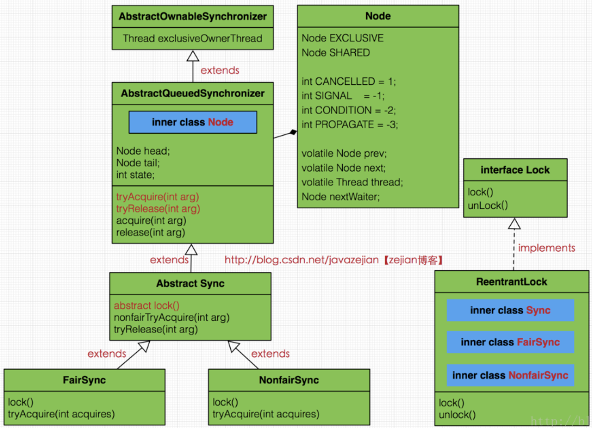

Node类使用`SHARED`和`EXCLUSIVE`常量分别代表共享模式和独占模式

- 共享模式是一个锁允许多条线程同时操作，如信号量**Semaphore**采用的就是基于AQS的共享模式实现
- 独占模式则是同一个时间段只能有一个线程对共享资源进行操作，多余的请求线程需要排队等待，如**ReentranLock**

`waitStatus`表示当前被封装成Node结点的等待状态

- CANCELLED：即结束状态，值为1，在同步队列中等待的线程等待超时或被中断，需要从同步队列中取消该Node的结点，进入该状态后的结点将不会再变化。


### Semaphore - 信号量

允许当前有n个线程可以并发执行。

```java
public Semaphore(int permits, boolean fair) {
  sync = fair ? new FairSync(permits) : new NonfairSync(permits);
}
```

构造器可以设置允许并发的线程数量，和是否公平。

- 准入数量 1 则等价于独占锁


作用和synchronized几乎一样，相当于其进化版。


使用场景：同一时间控制并发线程数

```java
public class SemaphoreCounter {
  private int sum = 0;
  private Semaphore readSemaphore = new Semaphore(100, true);
  private Semaphore writeSemaphore = new Semaphore(1);
  public int incrAndGet() {
    try {
      writeSemaphore.acquireUninterruptibly();
      return ++sum;
    } finally {
    	writeSemaphore.release();
    }
  }
  public int getSum() {
    try {
    	readSemaphore.acquireUninterruptibly();
    	return sum;
    } finally {
    	readSemaphore.release();
    }
  }
}
```


### CountDownLatch

通过计数来实现线程间协作。也是基于AQS。

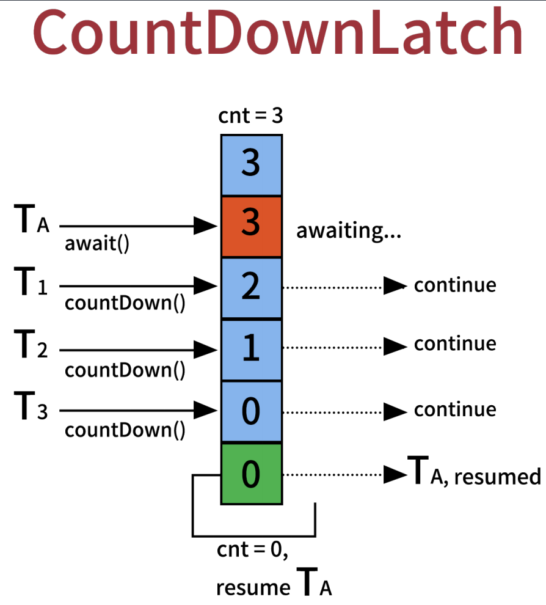

```java
public static class CountDownLatchTask implements Runnable {
  private CountDownLatch latch;
  public CountDownLatchTask(CountDownLatch latch) {
  	this.latch = latch;
  }
  @Override
  public void run() {
    Integer millis = new Random().nextInt(10000);
    try {
      TimeUnit.MILLISECONDS.sleep(millis);
      this.latch.countDown();
      System.out.println("我的任务OK了:"+Thread.currentThread().getName());
    } catch (Exception e) {
    	e.printStackTrace();
    }
  }
}

public static void main(String[] args) throws Exception {
  int num = 100;
  CountDownLatch latch = new CountDownLatch(num);
  List<CompletableFuture> list = new ArrayList<>(num);
  for (int i = 0; i < num; i++) {
    CompletableFuture<Void> future = CompletableFuture.runAsync(new CountDownLatchTask(latch));
    list.add(future);
  }
  latch.await();
  for (CompletableFuture future : list) {
  	future.get();
  }
}
```


### CyclicBarrier

不是基于AQS实现。

任务执行到一定阶段, 等待其他任务对齐，阻塞 N 个线程时所有线程被唤醒继续。


定义n个信号量，线程执行时需要等，不是在主线程await而是各个子线程await。


```java
public CyclicBarrier(int parties) // 构造方法（需要等待的数量）
public CyclicBarrier(int parties, Runnable barrierAction) // 构造方法（需要等待的数量, 需要执行的任务）
// Waits until all parties have invoked await on this barrier.
int await() // 任务内部使用; 等待大家都到齐
int await(long timeout, TimeUnit unit) //任务内部使用; 限时等待到齐
void reset() // 重新一轮
```

等await的数量达到设定数值，所有线程会被一起唤醒。


#### 与CountDownLatch的对比

| CountDownLatch                         | CyclicBarrier                              |
| -------------------------------------- | ------------------------------------------ |
| 在主线程里 await阻塞并做聚合           | 直接在各个子线程里 await 阻塞，回调聚合    |
| N 个线程执行了countdown，主线程继续    | N 个线程执行了 await 时，N 个线程继续      |
| 主线程里拿到同步点                     | 回调被最后到达同步点的线程执行             |
| 基于 AQS 实现，state 为 count，递减到0 | 基于可重入锁 condition.await/signalAll实现 |
| 不可以复用                             | 计数为0时重置为 N，可以复用                |

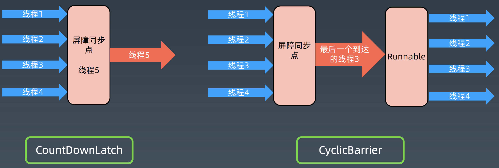


## 5 并发集合类 Collections

### CopyOnWriteArrayList

既想要线程安全，又尽量想要并发。


快照技术，读写分离，最终一致

- 多个线程读的时候，都读到同一个副本快照。

- 多比较多写特别少的场景非常高效


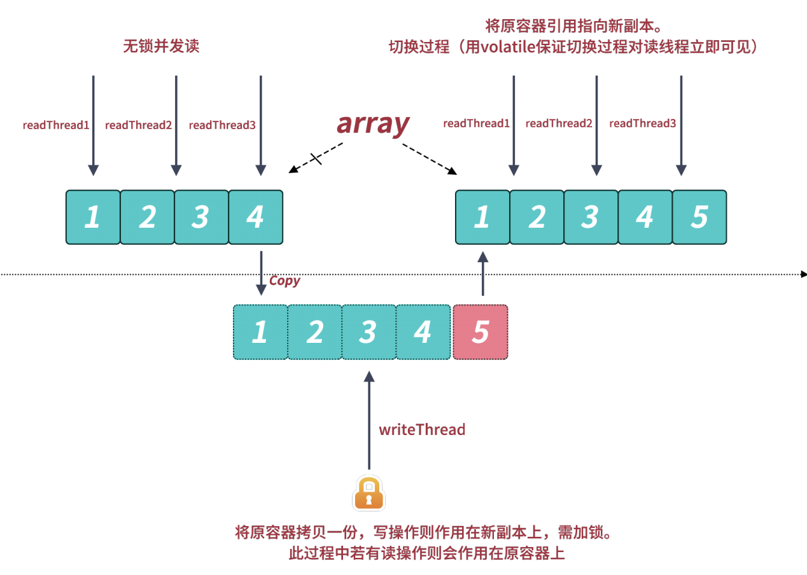

核心改进原理：

1. 修改加锁，保证不会写混乱
2. 修改在Copy 的副本上，而不是原始数据上
   - 新数组的操作，不会影响到对旧数组的读，读始终是不受影响的，直接读不加锁
   - 修改操作完之后，将旧数组的指针指向新数组


使用迭代器的时候， 直接拿当前的数组对象做一个快照，此 后的 List 元素变动，就跟这次迭代没关系了。

GC young 区用复制，old 区用本区内的移动


### ConcurrentHashMap

改进hashMap线程不安全的问题。加大锁可以解决问题，但是无法并发效率不能接收。

#### Java7 分段锁

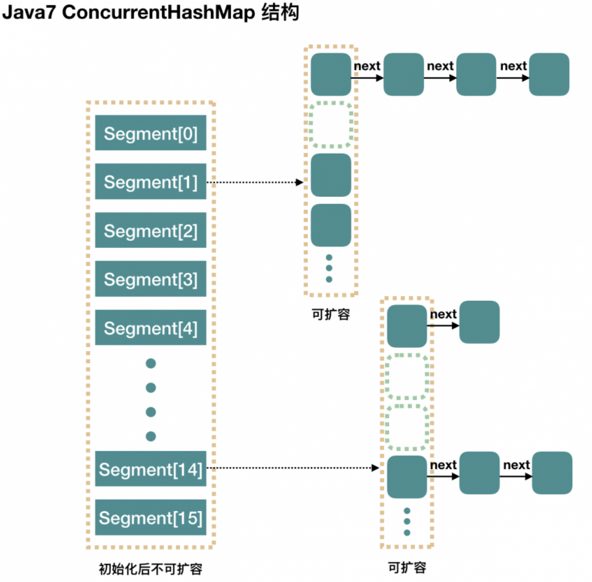

默认在hashMap中定义16个 Segment，每个段相当于是一个hashMap，有许多槽

- 降低锁粒度。 concurrentLevel = 16
- 操作时先hash取模判断在哪一个段，操作只锁这个段
- 每个段上一个小锁优于整个map一个大锁


两级hash取模 分离锁的机制和水平分库分表很相似

Segment[] 相当于分库，里面有很多桶

HashEntry[] hash到具体的段相当于分表，表中有链表 红黑树 多条数据

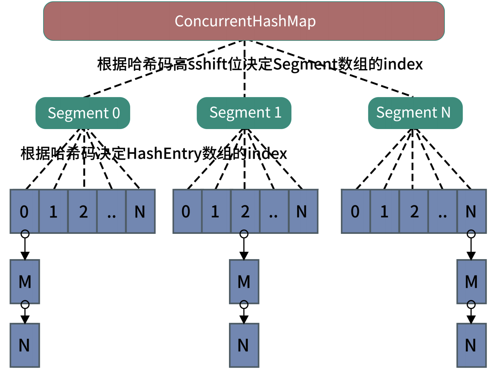


#### JDK8 数组加红黑树

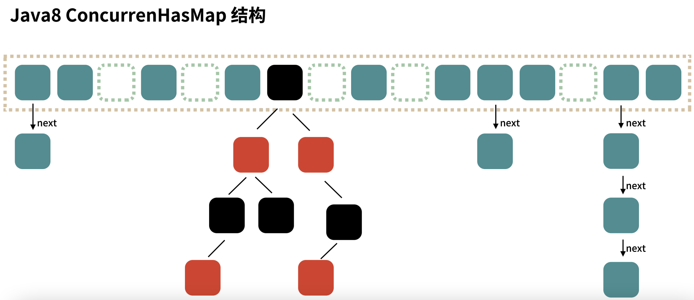


Java 7为实现并行访问，引入了 Segment，实现了分段锁，理论上最大并发度与 Segment 个数相等。


Java 8为进一步提高并发性，摒弃了分段锁的方案，而是直接使用一个大的数组。

- CAS无锁并发技术的成熟，大部分情况下可以不需要加锁，也就不需要分段锁
- 规模比较大时使用红黑树，红黑树天然可以将线程分配到不同的分支上去


### 线程安全实现的比较

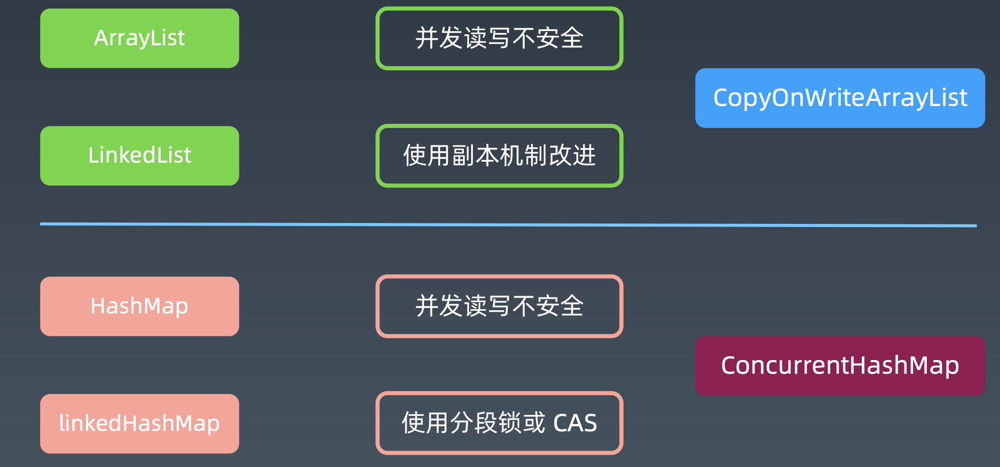


