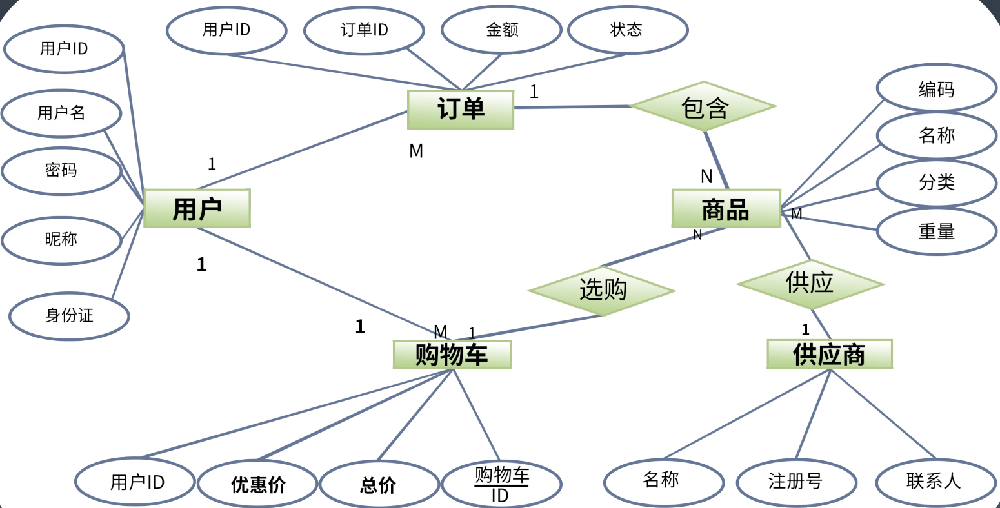
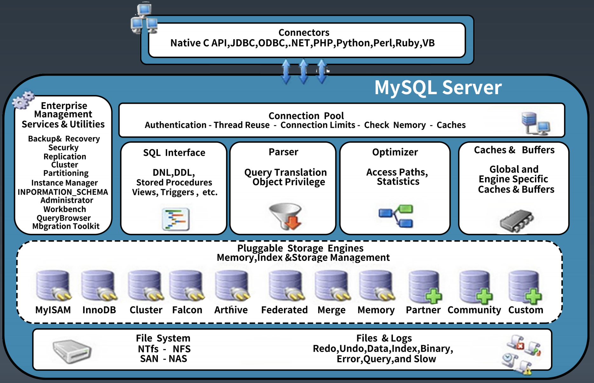
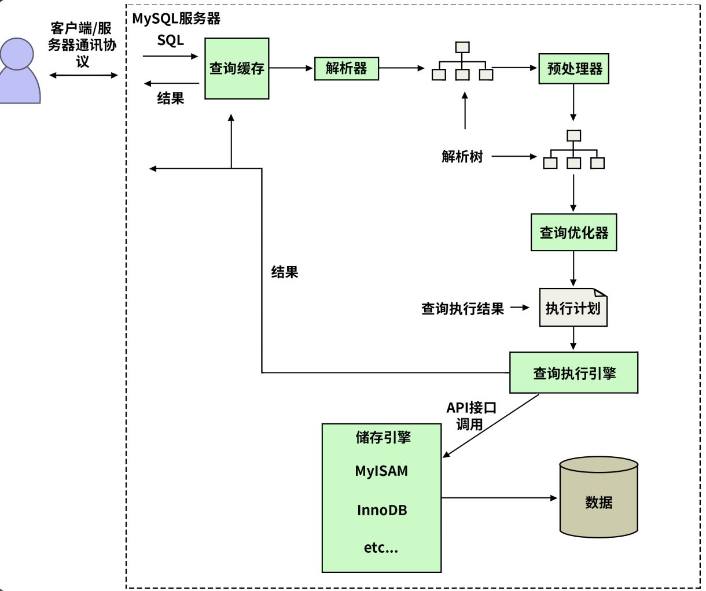
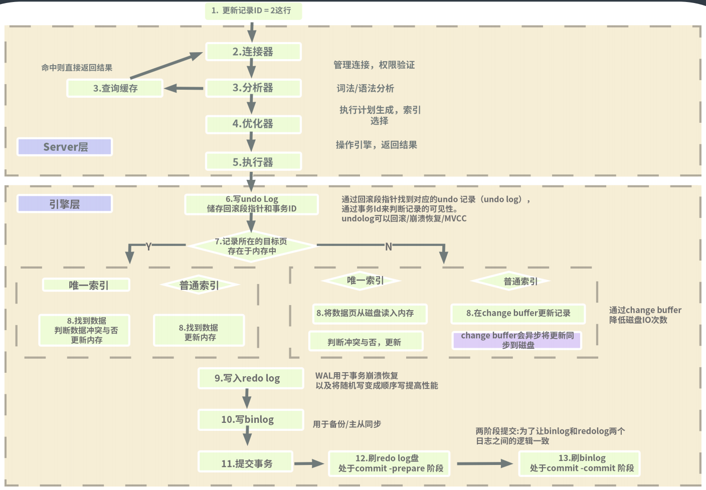
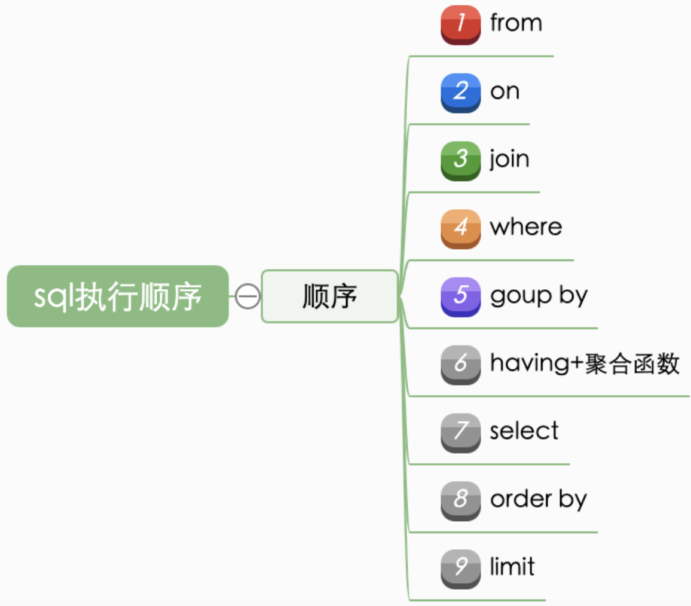

## 一、性能基础

### 什么是性能

性能是一个综合性问题

- 吞吐与延迟 ： 有些结论是反直觉的，指导我们关注什么
  - 对高吞吐还是低延迟更敏感
- 没有量化就没有改进：监控与度量指标，指导我们怎么去入手
- 80/20原则：先优化性能瓶颈问题，指导我们如何去优化
  - 对于业务系统，发展几年之后最有可能出现问题的就是数据库
    - sql / 表结构 / 数据库本身性能 复杂业务系统性能最应关注的点
- 过早的优化是万恶之源：指导我们要选择优化的时机
- 脱离场景谈性能都是耍流氓：指导我们对性能要求要符合实际


### DB/SQL 优化是业务系统性能优化的核心

业务系统的分类：

- 计算密集型，即cpu密集型，纯粗计算密集型的系统相对少见
- 数据密集型，数据库/IO操作密集

大部分应用处于两种情况之间，想对偏数据的方向。


业务处理本身无状态，数据状态最终要保存到数据库，数据库操作很可能是整个业务操作占比最大的部分。


一般来说，DB/SQL 操作的消耗在一次处理中占比最大

业务系统发展的不同阶段和时期，性能瓶颈要点不同，类似木桶装水


## 二、关系型数据库

1970年 Codd 提出关系模型，以关系代数理论为数学基础，实现一种数据存和取的方式。

- 以关系模型存储数据
- 使用关系代数做数据运算

《A Relational Model of Data for Large Shared Data Banks》

每张表可以看作一组关系的集合，每一行看作是一个关系的元组。

可以使用ER图来表示数据库的关系，即我们表结构的关系

- E 实体就是表，属性就是列
- 连线表示一条记录和另外一个表中的一条或多条数据的对应




对实体的拆分可大可小，有的大宽表300个字段，也可以5个字段一个表，如何设计比较合理？

### 数据库设计范式

#### 第一范式（1NF）

关系 R 属于第一范式，当且仅当 R 中的每一个属性 A 的值域只包含原子项

- 消除重复数据，即每一列都是不可再分的基本数据项

- 每个列都是原子的。


#### 第二范式（2NF）

在满足 1NF 的基础上，消除非主属性对码的部分函数依赖

- 消除部分依赖，表中没有列只与主键的部分相关，即每一行都被主键唯一标识
- 每个表都有主键。

#### 第三范式（3NF）

在满足 2NF 的基础上，消除非主属性对码的传递函数依赖

3NF：消除传递依赖，消除表中列不依赖主键，而是依赖表中的非主键列的情况，即没有列是与主 键不相关的。 从表只引用主表的主键， 即表中每列都和主键相关

#### BC 范式（BCNF）

在满足 3NF 的基础上，消除主属性对码的部分和传递函数依赖

BCNF：Boyce-Codd Normal Form（巴斯-科德范式） 

3NF 的基础上消除主属性对于码的部分与传递函数依赖。


### 常见数据库

开源：MySQL、PostgreSQL

商业：Oracle，DB2，SQL Server

内存数据库：Redis？，VoltDB

图数据库：Neo4j，Nebula

时序数据库：InfluxDB、openTSDB

其他关系数据库：Access、Sqlite、H2、Derby、Sybase、Infomix 等

NoSQL 数据库：MongoDB、Hbase、Cassandra、CouchDB

NewSQL/分布式数据库：TiDB、CockroachDB、NuoDB、OpenGauss、OB、TDSQL

### SQL 语言

SQL 语言是不是操作数据库必须的？

结构化查询语言包含6个部分：

1、数据查询语言（**DQL**: Data Query Language）：其语句，也称为“数据检索语句”，用以从表中获得数据，确 定数据怎样在应用程序给出。保留字 SELECT 是 DQL（也是所有 SQL）用得最多的动词，其他 DQL 常用的保留字 有 WHERE，ORDER BY，GROUP BY 和 HAVING。这些 DQL 保留字常与其它类型的 SQL 语句一起使用。 

2、数据操作语言（**DML**：Data Manipulation Language）：其语句包括动词 INSERT、UPDATE 和 DELETE。它 们分别用于添加、修改和删除。 

3、事务控制语言（TCL）：它的语句能确保被 DML 语句影响的表的所有行及时得以更新。包括COMMIT（提交） 命令、SAVEPOINT（保存点）命令、ROLLBACK（回滚）命令。

4、数据控制语言（DCL）：它的语句通过 GRANT 或 REVOKE 实现权限控制，确定单个用户和用户组对数据库对象 的访问。某些 RDBMS 可用 GRANT 或 REVOKE 控制对表单个列的访问。 

5、数据定义语言（**DDL**）：其语句包括动词 CREATE,ALTER 和 DROP。在数据库中创建新表或修改、删除表 （CREAT TABLE 或 DROP TABLE）；为表加入索引等。 

6、指针控制语言（CCL）：它的语句，像 DECLARE CURSOR，FETCH INTO 和 UPDATE WHERE CURRENT 用于对 一个或多个表单独行的操作。


## 三、Mysql基础

### 大体结构

mysql 大体分为 server层和存储引擎层。



**Server层**

- 连接器 跟客户端建立连接、获取权限、维持和管理连接
- 查询缓存
- 分析器 词法分析、语法分析
- 优化器 执行计划生成、决定使用哪个索引
- 执行器 权限验证、操作引擎、返回结果

对 SQL 的解析、分析、优化和缓存等功能，存储过程、触发器和视图都是在这里实现

**存储引擎**（插件式）

InnoDB、MyISAM、Memory 等。一般默认InnoDB，create table时可以指定如`engine=memory`


### 数据的存储 

绝大多数存储引擎都以二进制的形式存储数据。


在 InnoDB 存储引擎中，所有的数据都被**逻辑地**存放在**表空间**中，表空间（tablespace）是存储引擎中最高的存储逻辑单位，在表空间的下面又包括

- 段（segment）
- 区（extent）
- 页（page）

同一个数据库实例的所有表空间都有相同的页大小，默认innodb_page_size = 16KB。不同的页大小最终也会导致区大小的不同。

- 在 InnoDB 存储引擎中，一个区的大小最小为 1MB，其中页的数量最少为 64 个（16*64 = 1k）。

#### 如何存储表

MySQL 使用 InnoDB 存储表时，会将**表的定义**和**数据索引**等信息分开存储

- 表的定义存储在 `.frm` 文件中。`.frm` 文件的格式在不同的平台上都是相同的。
- 数据索引存储在 `.ibd` 文件中


###### **表空间概念**

*系统表空间*就是用来放系统信息的，比如数据字典什么的，对应的磁盘文件是`ibdata1`,
*数据表空间*就是一个个的表数据文件，对应的磁盘文件就是 `表名.ibd`


##### .ibd 文件

存储数据的文件总共有两个部分，一是系统表空间文件，包括 `ibdata1`、`ibdata2` 等文件，其中存储了 InnoDB 系统信息和用户数据库表数据和索引，是所有表公用的。

- 当打开 `innodb_file_per_table` 选项时，`.ibd` 文件就是每一个表独有的表空间，文件存储了当前表的数据和相关的索引数据。


#### 如何存储记录

##### 行存储

InnoDB 使用页作为磁盘管理的最小单位；数据在 InnoDB 存储引擎中都是按行存储的，每个 16KB 大小的页中可以存放 2-200 行的记录。

当 InnoDB 存储数据时，它可以使用不同的行格式进行存储

- Antelope 是 InnoDB 最开始支持的文件格式，它包含两种行格式 Compact 和 Redundant
- Barracuda 的出现引入了两种新的行格式 Compressed 和 Dynamic
- 从总体上上看，Compact 行记录格式相比 Redundant 格式能够减少 20% 的存储空间

行溢出

- 使用 Compact 或者 Redundant 格式存储极长的 VARCHAR 或者 BLOB 这类大对象时，我们并不会直接将所有的内容都存放在数据页节点中，而是将行数据中的前 768 个字节存储在数据页中，后面会通过偏移量指向溢出页。
-  Compressed 或者 Dynamic 都只会在行记录中保存 20 个字节的指针，实际的数据都会存放在溢出页面中

##### 页存储

页是 InnoDB 存储引擎管理数据的最小磁盘单位，而 B-Tree 节点就是实际存放表中数据的页面。


每一个页中包含了两对 header/trailer：内部的 Page Header/Page Directory 关心的是页的状态信息，而 Fil Header/Fil Trailer 关心的是记录页的头信息。

在页的头部和尾部之间就是用户记录和空闲空间了，每一个数据页中都包含 Infimum 和 Supremum 这两个**虚拟**的记录（可以理解为占位符），Infimum 记录是比该页中任何主键值都要小的值，Supremum 是该页中的最大值。

User Records 就是整个页面中真正用于存放行记录的部分，而 Free Space 就是空余空间了，它是一个链表的数据结构，为了保证插入和删除的效率，整个页面并不会按照主键顺序对所有记录进行排序，它会自动从左侧向右寻找空白节点进行插入，行记录在物理存储上并不是按照顺序的，它们之间的顺序是由 `next_record` 这一指针控制的。


B+ 树在查找对应的记录时，并不会直接从树中找出对应的行记录，它只能获取记录所在的页，将整个页加载到内存中，再通过 Page Directory 中存储的稀疏索引和 `n_owned`、`next_record` 属性取出对应的记录，不过因为这一操作是在内存中进行的，所以通常会忽略这部分查找的耗时。


#### 数据文件夹下的文件

```less
➜  ~ cd /usr/local/var/mysql/
➜  mysql ll | grep -v pem
total 245864
-rw-r-----    1 fanlu  admin      4444 Jun 16 18:43 Fanlus-MacBook-Pro.local.err
-rw-r-----    1 fanlu  admin  50331648 Jun 16 15:31 ib_logfile0 // 日志组
-rw-r-----    1 fanlu  admin  12582912 Jun 16 15:31 ibdata1 // 数据
-rw-r-----    1 fanlu  admin  12582912 Jun 16 15:31 ibtmp1
-rw-r-----    1 fanlu  admin         6 Jun 16 15:31 Fanlus-MacBook-Pro.local.pid
drwxr-xr-x   21 fanlu  admin       672 Jun 16 15:31 .
-rw-r-----    1 fanlu  admin       436 Jun 16 15:17 ib_buffer_pool
drwxr-x---  108 fanlu  admin      3456 Jun 16 15:17 sys
drwxr-x---   77 fanlu  admin      2464 Jun 16 15:17 mysql
drwxr-x---   90 fanlu  admin      2880 Jun 16 15:17 performance_schema
-rw-r-----    1 fanlu  admin        56 Jun 16 15:17 auto.cnf
-rw-r-----    1 fanlu  admin  50331648 Jun 16 15:17 ib_logfile1
drwxrwxr-x    4 fanlu  admin       128 Jun 16 15:17 ..
```

除了.frm .ibd

**日志组文件**：ib_logfile0 和 ib_logfile1，默认均为5M 

**字符集和排序规则文件**：db.opt 

**binlog** 二进制日志文件：

- 记录主数据库服务器的 DDL 和 DML 操作 

**二进制日志索引文件**：master-bin.index 


### SQL执行流程

#### 简化流程

解析树 AST

执行计划



#### 复杂流程

以innodb为例





#### SQL执行顺序



define table /do filter /show data

实际上这个过程也并不是绝对这样的，中间 mysql 会有部分的优化以达到最佳的优化效 果，比如在 select 筛选出找到的数据集。


### 数据库和实例

数据库：物理操作文件系统或其他形式文件类型的集合；

实例：MySQL 数据库由后台线程以及一个共享内存区组成；


MySQL 中，实例和数据库往往都是一一对应的，而我们也无法直接操作数据库，而是要**通过数据库实例来操作数据库文件**，可以理解为数据库实例是数据库为上层提供的一个专门用于操作的接口。

在 Unix 上，启动一个 MySQL 实例往往会产生两个进程，`mysqld` 就是真正的数据库服务守护进程，而 `mysqld_safe` 是一个用于检查和设置 `mysqld` 启动的控制程序，它负责监控 MySQL 进程的执行，当 `mysqld` 发生错误时，`mysqld_safe` 会对其状态进行检查并在合适的条件下重启。


