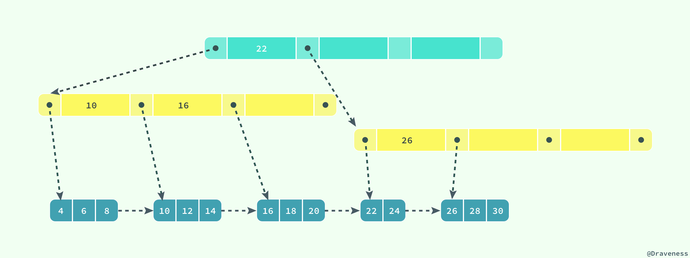

## 索引

**索引优化是对查询性能优化的最有效手段**，它能够轻松地将查询的性能提高几个数量级。


更新一个包含索引的表需要比更新一个没有索引的表更多的时间，这是由于索引本身也需要更新。理想的做法是仅仅在常常被搜索的列（以及表）上面创建索引。


### InnoDB 存储引擎

InnoDB 存储引擎在绝大多数情况下使用 B+ 树建立索引，这是关系型数据库中查找最为常用和有效的索引，但是 B+ 树索引并不能找到一个给定键对应的具体值，它只能找到数据行对应的页，然后正如上一节所提到的，数据库把整个页读入到内存中，并在内存中查找具体的数据行。 





B+ 树是平衡树，它查找任意节点所耗费的时间都是完全相同的，比较的次数就是 B+ 树的高度


数据库中的 B+ 树索引可以分为聚集索引（clustered index）和辅助索引（secondary index），它们之间的最大区别就是，聚集索引中存放着一条行记录的全部信息，而辅助索引中只包含索引列和一个用于查找对应行记录的『书签』。

- clustered index ：聚集索引/主键索引/ 聚集索引
- secondary index：辅助索引/非主键索引/普通索引/二级索引


#### 聚集索引

在 InnoDB 中，表中数据都是**根据键的顺序以索引的形式存放**，这种存储方式的表称为**索引组织表**。

- 聚集索引与表的物理存储方式有着非常密切的关系，所有正常的表应该**有且仅有一个**聚集索引（绝大多数情况下都是主键），表中的所有行记录数据都是按照**聚集索引**的顺序存放的。
- 当我们使用聚集索引对表中的数据进行检索时，可以直接获得聚集索引所对应的整条行记录数据所在的页，不需要进行第二次操作。
- 页之间也通过双向指针相连，不断获取下一条记录可以不走上面的索引


当一个数据被用到时，通常其附近的数据也通常会马上被使用，读取磁盘时读取一块可以满足快速访问的需要，因此在非从性能和存储空间方面考量，自增主键往往是更合理的选择。


一个数据页满了，按照B+Tree算法，新增加一个数据页，叫做**页分裂**，会导致性能下降，空间利用率降低50%。当相邻的两个数据页利用率很低的时候会做数据页合并，合并的过程是分裂过程的逆过程。


聚簇索引也叫聚集索引，它实际上并不是一种单独的索引类型，而是一种**数据存储方式**。

- 表数据按照索引的顺序来存储，也就是说索引项的顺序与表中记录的物理顺序一致。对于聚集索引，叶子结点即存储了真实的数据行，不再有另外单独的数据页。 在一张表上最多只能创建一个聚集索引，因为真实数据的物理顺序只能有一种。
- MySQL InnoDB表是**索引组织表**（oracle则一般使用**堆表**）
  - 表中的所有数据行都放在索引上，这就约定了数据是按照聚簇索引(主键索引)顺序存放的，因此不管记录的插入先后顺序，它在物理页上的位置与插入的先后顺序无关，与聚簇索引相关。找到了索引就找到了需要的数据。
  - InnoDB中，每个表必须有一个聚簇索引，默认是根据主键建立。如果表中没有主键，InnoDB会选择一个合适的列（第一个非空的唯一列）作为聚簇索引，如果找不到合适的列，会使用一列隐藏的列`DB_ROW_ID`作为聚簇索引。
- 聚集索引是一种稀疏索引，数据页上一级的索引页存储的是页指针，而不是行指针


#### 辅助索引

数据库将所有的非聚集索引都划分为辅助索引，辅助索引也是通过 B+ 树实现的，但是它的叶节点并不包含行记录的全部数据，仅包含**索引中的所有键**和一个用于查找对应行记录的『书签』，在 InnoDB 中这个书签就是**当前记录的主键**。

一张表一般包含一个聚集索引构成的 B+ 树以及若干辅助索引的构成的 B+ 树。

- 新建索引就是新增一个B+树，查询不走索引就是遍历主B+树。

Innodb中，表中的数据（主键索引）还是辅助索引最终都会使用 B+ 树来存储数据，其中前者在表中会以 `<id, row>` 的方式存储，而后者会以 `<index, id>` 的方式进行存储。

- 在主键索引中，`id` 是主键，我们能够通过 `id` 找到该行的全部列；
- 在辅助索引中，索引中的几个列构成了键，我们能够通过索引中的列找到 `id`，如果有需要的话，可以再通过 `id` 找到当前数据行的全部内容


非聚簇索引也叫**辅助索引**、**普通索引**，叶结点包含索引字段值及指向数据页数据行的逻辑指针，即它的叶子节点只包含一个主键值

- 通过非聚簇索引查找记录要先找到主键，然后通过主键再到聚簇索引中找到对应的记录行，这个过程被称为**回表**。（类似oracle通过键值找到rowid，再通过rowid找到行）
- 即索引的存储和数据的存储是分离的，表数据存储顺序与索引顺序无关，找到了索引可能还没找到数据。
- 如果辅助索引已经能够得到查询的所有信息了，就无需再回表，这个就是**覆盖索引**。

- 非聚集索引是密集索引，在数据页的上一级索引页它为每一个数据行存储一条索引记录。

非聚集索引就是二级索引，所有普通索引(非聚簇)都是二级索引。


##### 索引组织表和堆表

堆表以一种显然随机的方式管理，数据插入时时存储位置是随机的，主要是数据库内部块的空闲情况决定，数据会放在最合适的地方，而不是以某种特定顺序来放置。

- 堆表的存储速度因为不用考虑排序, 所以存储速度会比较快；但是要查找符合某个条件的记录, 就必须得读取全部的记录以便筛选。
- 堆表其索引中记录了记录所在位置的rowid，查找的时候先找索引，然后再根据索引rowid找到块中的行数据。
- 堆表的索引和表数据是分离的
- 比较而言索引组织表，其行数据以索引形式存放，因此找到索引，就等于找到了行数据。索引组织表索引和数据是在一起的。


#### 为什么 Innodb 使用 B+ 树

Innodb中，表中的数据（主键索引）还是辅助索引最终都会使用 B+ 树来存储数据。why？

- InnoDB 需要支持的场景和功能需要在特定查询上拥有较强的性能；
- CPU 将磁盘上的数据加载到内存中需要花费大量的时间，这使得 B+ 树成为了非常好的选择


##### 不用hashtable

使用 B+ 树作为底层的数据结构，那么所有只会访问或者修改一条数据的 SQL 的时间复杂度都是 `O(log n)`。

- 虽然使用哈希有可能达到 `O(1)` 的时间复杂度，它对于处理**范围查询或者排序性能会非常差**，只能进行全表扫描并依次判断是否满足条件。
  - 全表扫描对于数据库来说是一个非常糟糕的结果，这其实也就意味着我们使用的数据结构对于这些查询没有其他任何效果，最终的性能可能都不如从日志中顺序进行匹配。
- 使用 B+ 树其实能够保证数据按照键的顺序进行存储，也就是相邻的所有数据其实都是按照自然顺序排列的，使用哈希却无法达到这样的效果


##### 不用B树

计算机在读写文件时会以页为单位将数据加载到内存中。页的大小可能会根据操作系统的不同而发生变化，不过在大多数的操作系统中，页的大小都是 `4KB`。

```shell
$ getconf PAGE_SIZE
4096
```

数据从磁盘读取到内存中所需要的成本是非常大的，普通磁盘（非 SSD）加载数据需要经过队列、寻道、旋转以及传输的这些过程，大概要花费 `10ms` 左右的时间。

 `10ms` 这个数量级对随机 I/O 占用的时间进行估算，随机 I/O 对于 MySQL 的查询性能影响会非常大，而顺序读取磁盘中的数据时速度可以达到 40MB/s，这两者的性能差距有几个数量级，由此我们也应该尽量减少随机 I/O 的次数，这样才能提高性能。

B 树与 B+ 树的最大区别就是，B 树可以在非叶结点中存储数据，但是 B+ 树的所有数据其实都存储在叶子节点中。

- 在非叶结点中存储数据，意味着可能需要做多次随机 I/O。
- B+ 树中就不存在这个问题，因为所有的数据行都存储在叶节点中，而这些叶节点可以**通过『指针』依次按顺序连接** 


##### 单表可存储数据计算

1. mysql一个数据块，也就是一页一般16k。

- **每块大概存16条记录**，假设常规的表一条记录是1k，一个块存放16条记录。

- **每块大概存1100个索引记录**， 主键类型是bigint，8B，在innodb中一个指针大小一般是6B，所以主键和指针加起来占用14B。16k/14

2. 对于B+树3层是可以接受的下限

- **一棵树能够索引1.3M个块**，第一层和第二层总共能够存储 (16k / 14)^2 条记录

因此，**1.3M * 16 约为2100万**


#### 其他索引模型（实现数据结构）

1. **哈希表** 适用于只有**等值查询**（不是有序的 查区间很慢）的场景，比如 Memcached 及其他一些 NoSQL 引擎。
2. **有序数组** 等值查询和范围查询场景中的性能就都非常优秀，但只适用于静态存储引擎（数据不会发生变化），比如2017 年某个城市的所有人口信息
3. **跳表** 
4. **LSM 树** 日志结构合并树(Log-Structured Merge-Tree)  LSM树能将随机操作变为顺序操作，顺序写磁盘，从而大幅提升写操作，作为代价的是牺牲了一些读性能。


#### 基于主键索引/普通索引的查询

- 如果语句是 select * from T where ID=500，即主键查询方式，则只需要搜索 ID 这棵 B+ 树；
- 如果语句是 select * from T where k=5，即普通索引查询方式，则需要先搜索 k 索引树，得到 ID 的值为 500，再到 ID 索引树搜索一次。这个过程称为**回表**。

因此在应用中应该尽量使用主键查询。

如果查询条件使用的是普通索引（或是联合索引的最左原则字段），查询结果是联合索引的字段或是主键，不用回表操作，直接返回结果，减少IO磁盘读写读取正行数据


联合索引又叫**复合索引**。对于复合索引，Mysql从左到右的使用索引中的字段，一个查询可以只使用索引中的一部份，但只能是最左侧部分。

例如索引是key index (a,b,c). 可以支持**a** | **a,b**| **a,b,c** 3种组合进行查找，但不支持 b,c进行查找 

##### 最左前缀原则

索引的复用能力。B+ 树这种索引结构，可以利用索引的“最左前缀”，来定位记录。所以当已经有了 (a,b) 这个联合索引后，一般就不需要单独在 a 上建立索引了。因此安排索引内字段顺序的第一原则是，如果通过调整顺序，可以少维护一个索引，那么这个顺序往往就是需要优先考虑采用的。

当对多列创建索引后，并不是只要包含了创建索引的列就能使用索引，索引的使用要遵循最左前缀匹配原则。

假设对列`(A, B, C)`创建索引，那么只有以下场景能使用索引：

1. 对列`(A, B, C)`/`(A, C)`或者`(A, B)`进行查询会匹配索引，对`(C, A)`或者`(B, C)`来说不能使用索引。

2. 通配符只能使用`LIKE 'val%'`形式，不能使用`LIKE '%VAL%'`，后者会导致全表扫描。

3. 索引列不能进行运算，例如`WHERE A + 1 = 5`这种场景会导致索引失效。

4. 索引列不能包含范围值查询，如`LIKE/BETWEEN/>/<`等都会导致后面的列无法匹配索引。

5. 索引列不能包含有NULL值。

   

##### 索引下推

当有查询（和索引中的）字段有多个，根据最左前缀匹配到第一个之后，后面的条件如何处理？

在 MySQL 5.6 之前，只能从 匹配处开始一个个回表。到主键索引上找出数据行，再对比字段值。

而 MySQL 5.6 引入的**索引下推**优化（index condition pushdown)， 可以在索引遍历过程中，（InnoDB 在索引内部）对索引中包含的字段先做判断，直接过滤掉不满足条件的记录，减少回表次数。


Q&A: 表有abc 三个字段，其中ab是联合主键，c 上创建一个索引，是否还需要 ca 和 cb索引？

InnoDB会把主键字段放到索引定义字段后面，当然同时也会去重。所以，当主键是(a,b)的时候，

- 定义为c的索引，实际上是（c,a,b)
- 定义为(c,a)的索引，实际上是(c,a,b)

是相同的。ps 定义为(c,b）的索引，实际上是（c,b,a)

所以不需要ca，需要cb。


### 索引应用

#### 查看 SQL 是不是使用了索引？

在select语句前加上EXPLAIN即可


#### 字段选择性

某个字段的重复成都称为该字段的选择性

F = DISTINCT(col) / count(*) 越离散选择性越好。


#### 查询和更新过程

##### 查询过程

B+ 树从树根开始，按层搜索到叶子节点，数据页内部通过二分法来定位记录

- 对于普通索引来说，查找到满足条件的第一个记录后需要继续查找，直到找到不满足的
- 对于唯一索引来说，由于索引定义了唯一性，查找到第一个满足条件的记录后，就会停止继续检索。

InnoDB 引擎是按数据页为单位来读写的。也就是说，当需要读一条记录的时候，并不是将这个记录本身从磁盘读出来，而是以页为单位，将其整体读入内存。


##### 更新过程

第一种情况是，这个记录要更新的目标页在内存中。普通索引和唯一索引对更新语句性能影响的差别，只是一个判断，只会耗费微小的 CPU 时间。

第二种情况是，这个记录要更新的目标页不在内存中。这时，InnoDB 的处理流程如下：

- 对于唯一索引来说，需要将数据页读入内存，判断到没有冲突，插入这个值，语句执行结束；
- 对于普通索引来说，则是将更新记录在 change buffer，语句执行就结束了。


#### 索引冗余

索引的数据量可能比表数据量还多

常见问题

- 长的包含短的，形成冗余

- 字段有唯一约束的，与其他组合在一起是冗余的


#### 给字符串字段加索引

##### 前缀索引

```sql
mysql> alter table SUser add index index1(email);
mysql> alter table SUser add index index2(email(6));
```

第一个语句创建的 index1 索引里面，包含了每个记录的整个字符串；而第二个语句创建的 index2 索引里面，对于每个记录都是只取前 6 个字节.

使用前缀索引，定义好长度，就可以做到既节省空间，又不用额外增加太多的查询成本。


##### 使用多长的前缀呢？

我们在建立索引时关注的是**区分度**，区分度越高越好。因为区分度越高，意味着重复的键值越少。我们可以通过统计索引上有多少个不同的值来判断要使用多长的前缀。

单纯用前缀的区分度不够好的情况时，我们要怎么办呢？

- 使用倒序存储，不会消耗额外的存储空间，调用一次 reverse 函数
- 使用 hash 字段，需要增加一个字段，调用一次 crc32() 函数，存储和计算开销都更大。不过使用 hash 字段方式的查询性能相对更稳定一些。因为 crc32 算出来的值虽然有冲突的概率，但是概率非常小

##### 使用前缀索引的缺点

- 匹配数量多还需要反复回主键索引查询，反而增加查询次数
- 使用前缀索引就用不上覆盖索引对查询性能的优化


##### 唯一索引和普通索引的选择

建议你尽量选择**普通索引**。这两类索引在查询能力上是没差别的，主要考虑的是对**更新性能**的影响。将数据从磁盘读入内存涉及随机 IO 的访问，是数据库里面成本最高的操作之一。change buffer 因为减少了随机磁盘访问，所以对更新性能的提升是会很明显的。。

**唯一索引的应用场景**。业务务不能保证，或者业务就是要求数据库来做约束，那么没得选，必须创建唯一索引。业务正确性优先。

即使这样，在一些“归档库”的场景，为提高归档效率可以考虑把表里面的唯一索引改成普通索引。


#### 优化器的逻辑

选择索引是优化器的工作，选择索引的目的，是找到一个最优的执行方案，并用最小的代价去执行语句。在数据库里面，扫描行数是影响执行代价的因素之一。扫描的行数越少，意味着访问磁盘数据的次数越少，消耗的 CPU 资源越少。当然，扫描行数并不是唯一的判断标准，优化器还会结合是否使用临时表、是否排序等因素进行综合判断。

MySQL 在真正开始执行语句之前，并不能精确地知道满足这个条件的记录有多少条，而只能根据统计信息来估算记录数。这个统计信息就是索引的“**区分度**”。显然，一个索引上不同的值越多，这个索引的区分度就越好。而一个索引上不同的值的个数，我们称之为“基数”（**cardinality**）。也就是说，这个基数越大，索引的区分度越好。

使用普通索引还把回表的代价算进去。


MySQL **是怎样得到索引的基数**

采样统计，InnoDB 默认会选择 N 个数据页，统计这些页面上的不同值，得到一个平均值，然后乘以这个索引的页面数，就得到了这个索引的基数。当表变更的数据行数超过 1/M 的时候，会自动触发重新做一次索引统计。

在 MySQL 中，有两种存储索引统计的方式，可以通过设置参数 innodb_stats_persistent 的值来选择：

- 设置为 on 的时候，表示统计信息会持久化存储。这时，默认的 N 是 20，M 是 10。
- 设置为 off 的时候，表示统计信息只存储在内存中。这时，默认的 N 是 8，M 是 16。

`analyze table tablename` 命令，可以用来重新统计索引信息


### change buffer

当需要更新一个数据页时，如果数据页在内存中就直接更新，而如果这个数据页还没有在内存中的话，在不影响数据一致性的前提下，InnoDB 会将这些更新操作缓存在 `change buffer` 中，这样就不需要从磁盘中读入这个数据页了。在下次查询需要访问这个数据页的时候，将数据页读入内存，然后执行 change buffer 中与这个页有关的操作。通过这种方式就能保证这个数据逻辑的正确性。

change buffer是可以持久化的数据，在内存中有拷贝，也会被写入到磁盘上。

将 change buffer 中的操作应用到原数据页，得到最新结果的过程称为 `merge`。除了访问这个数据页会触发 merge 外，系统有后台线程会定期 merge。在数据库正常关闭（shutdown）的过程中，也会执行 merge 操作。

##### change buffer仅限于普通索引

对于唯一索引来说，所有的更新操作都要先判断这个操作是否违反唯一性约束。这必须要将数据页读入内存才能判断。如果都已经读入到内存了，那直接更新内存会更快，就没必要使用 change buffer 了。

##### change buffer 应用场景

对于写多读少的业务来说，页面在写完以后马上被访问到的概率比较小，此时 change buffer 的使用效果最好。

假设一个业务的更新模式是写入之后马上会做查询，那么即使满足了条件，将更新先记录在 change buffer，但之后由于马上要访问这个数据页，会立即触发 merge 过程。这样随机访问 IO 的次数不会减少，反而增加了 change buffer 的维护代价。所以，对于这种业务模式来说，change buffer 反而起到了副作用。

##### change buffer 和 redo log

https://time.geekbang.org/column/article/70848

redo log 主要节省的是随机写磁盘的 IO 消耗（转成顺序写），而 change buffer 主要节省的则是随机读磁盘的 IO 消耗。

