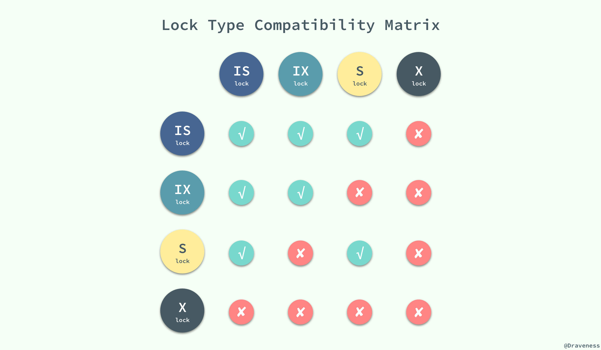

## 一、日志模块

redo log（重做日志）和 binlog（归档日志），undo log

### redo log 重做日志

事务执行过程中写入 redo log，**记录事务对数据页做了哪些修改**。确保事务的持久性，防止事务提交后数据未刷新到磁盘就掉电或崩溃。

InnoDB 引擎特有。


#### WAL 技术 Write-Ahead Logging

关键点是先写日志，（等空闲时）再写磁盘。

- 当有一条记录需要更新的时候，InnoDB 引擎就会先把记录写到 redo log里面，并更新内存，这个时候更新就算完成了。
- 同时，InnoDB 引擎会在适当的时候，将这个操作记录更新到磁盘里面，往往是在系统比较空闲的时候做。


InnoDB 的 redo log 是固定大小的，比如可以配置为一组 4 个文件，每个文件的大小是 1GB，总共就可以记录 4GB 的操作。从头开始写，写到末尾就又回到开头循环写。

`write pos` 是当前记录的位置，一边写一边后移，`checkpoint`是当前要擦除的位置，也是往后推移并且循环。

通过redo log 能够实现crash-safe。


- 日志文件: ib_logfile0, ib_logfile1
- 日志缓冲: innodb_log_buffer_size
- 强刷: fsync()

#### bin log 和 redo log的关联

1. redo log 是 InnoDB 引擎特有的；binlog 是 MySQL 的 Server 层实现的
2. redo log 是**物理日志**，记录的是“在某个数据页上做了什么修改”；binlog 是逻辑日志，记录的是这个语句的原始逻辑，比如“给 ID=2 这一行的 c 字段加 1 ”。
3. redo log 是循环写的，空间固定会用完；binlog 是可以追加写入的。“追加写”是指 binlog 文件写到一定大小后会切换到下一个，并不会覆盖以前的日志。

### **两阶段提交**（`perpare` 和 `commit`阶段）

- （执行器）读取表中需要update的那一行
- （InnoDB）查询该行信息是否在内存中。若没有则从磁盘读取到内存。然后都返回行数据
- （执行器）更改行数据、写入新行
- （InnoDB）新行更新到内存，写入redo log （此时处于**prepare**阶段）
- （执行器）写入binlog
  - 先把 binlog 从 binlog cache 中写到磁盘上的 binlog 文件；
  - 调用 fsync 持久化。
- （执行器调用InnoDB）提交事务 （此时处于**commit**阶段）

使用“两阶段提交”是为了避免恢复时恢复出来的数据库与原有状态不一致的现象。


#### 不同瞬间异常重启，怎么保证数据完整性？

写入新行，更新到内存

```
写入redo log，处于prepare阶段

写入bin log

提交事物，处于commit阶段
```

##### 写入redo 没写bin

写入 redo log 处于 prepare 阶段之后、写 binlog 之前，发生了崩溃（crash），由于此时 binlog 还没写，redo log 也还没提交（就丢失掉了），所以崩溃恢复的时候，这个事务会回滚。（该事务的DML失效）

##### 写入bin log 成功，redo还没有commit成功

binlog 写完，redo log 还没 commit 前发生 crash，那崩溃恢复的时候 MySQL 会怎么处理？

- 如果 redo log 里面的事务是完整的（已经有了 commit 标识），则直接提交；

- 如果 redo log 里面的事务只有完整的 prepare，则判断对应的事务 binlog 是否存在并完整：

  - 如果是，则提交事务；
  - 否则，回滚事务


### binlog 

#### 写入过程

1. 事务执行过程中，先把日志写到 `binlog cache`，

2. 事务提交的时候，再把 binlog cache 写到 binlog 文件中，并清空binlog cache。

一个事务的 binlog 是不能被拆开的，因此不论这个事务多大，也要确保一次性写入。这就涉及到了 binlog cache 的保存问题。

#### binlog cache

参数 `binlog_cache_size` 用于控制单个线程内 binlog cache 所占内存的大小。如果超过了这个参数规定的大小，就要暂存到磁盘。


系统给 binlog cache 分配了一片内存，每个线程一个（即binlog cache会有多个，它们共用同一份 binlog 文件）。

binlog cache 到 磁盘文件要经历 write + fsync：

- write，指的就是指把日志写入到文件系统的 **page cache**，并没有把数据持久化到磁盘，所以速度比较快。

- fsync，才是将数据持久化到磁盘的操作。一般情况下，我们认为 fsync 才占磁盘的 IOPS。


`sync_binlog` 控制

- sync_binlog=0 的时候，表示每次提交事务都只 write，不 fsync；

- sync_binlog=1 的时候，表示每次提交事务都会执行 fsync；

- sync_binlog=N(N>1) 的时候，表示每次提交事务都 write，但累积 N 个事务后才 fsync。


将 sync_binlog 设置为 N，比较常见的是将其设置为 100~1000 中的某个数值。N大一些可以提升性能，解决IO 瓶颈。

对应的风险是：如果主机发生异常重启，会丢失最近 N 个事务的 binlog 日志。


#### bin log的三种格式

1.**Statement**：每一条会修改数据的sql都会记录在binlog中。

优点：不需要记录每一行的变化，减少了binlog日志量，节约了IO，提高性能。(相比row能节约多少性能与日志量，这个取决于应用的SQL情况，正常同一条记录修改或者插入row格式所产生的日志量还小于Statement产生的日志量，但是考虑到如果带条件的update操作，以及整表删除，alter表等操作，ROW格式会产生大量日志，因此在考虑是否使用ROW格式日志时应该跟据应用的实际情况，其所产生的日志量会增加多少，以及带来的IO性能问题。)

缺点：由于记录的只是执行语句，为了这些语句能在slave上正确运行，因此还必须记录每条语句在执行的时候的一些相关信息，以保证所有语句能在slave得到和在master端执行时候相同的结果。另外mysql 的复制,像一些特定函数功能，slave可与master上要保持一致会有很多相关问题(如sleep()函数， last_insert_id()，以及user-defined functions(udf)会出现问题).

2.**Row**:不记录sql语句上下文相关信息，仅保存哪条记录被修改。

优点： binlog中可以不记录执行的sql语句的上下文相关的信息，仅需要记录那一条记录被修改成什么了。所以rowlevel的日志内容会非常清楚的记录下每一行数据修改的细节。而且不会出现某些特定情况下的存储过程，或function，以及trigger的调用和触发无法被正确复制的问题

缺点:所有的执行的语句当记录到日志中的时候，都将以每行记录的修改来记录，这样可能会产生大量的日志内容,比如一条update语句，修改多条记录，则binlog中每一条修改都会有记录，这样造成binlog日志量会很大，特别是当执行alter table之类的语句的时候，由于表结构修改，每条记录都发生改变，那么该表每一条记录都会记录到日志中。

3.**Mixedlevel**: 是以上两种level的混合使用，一般的语句修改使用statment格式保存binlog，如一些函数，statement无法完成主从复制的操作，则采用row格式保存binlog,MySQL会根据执行的每一条具体的sql语句来区分对待记录的日志形式，也就是在Statement和Row之间选择一种.新版本的MySQL中队row level模式也被做了优化，并不是所有的修改都会以row level来记录，像遇到表结构变更的时候就会以statement模式来记录。至于update或者delete等修改数据的语句，还是会记录所有行的变更。


### redo log 的写入机制

redo log 可能存在的三种状态： 

- redo log buffer, 物理上是在 MySQL 进程内存中
- fs page cache, 写到磁盘 (write)，但是没有持久化（fsync)，物理上是在文件系统的 page cache 里
-  hard disk, 持久化到磁盘

日志写到 redo log buffer 是很快的，wirte 到 page cache 也差不多，但是持久化到磁盘的速度就慢多了。


`innodb_flush_log_at_trx_commit` 控制写入策略

- 设置为 0 的时候，表示每次事务提交时都只是把 redo log 留在 redo log buffer 中 ;
- 设置为 1 的时候，表示每次事务提交时都将 redo log 直接持久化到磁盘。redo log 在 prepare 阶段就要持久化一次；
- 设置为 2 的时候，表示每次事务提交时都只是把 redo log 写到 page cache


InnoDB 有一个后台线程，每隔 1 秒，就会把 redo log buffer 中的日志，调用 write 写到文件系统的 page cache，然后调用 fsync 持久化到磁盘。事务执行**中间过程的 redo log** 也是直接写在 redo log buffer 中的，这些 redo log 也会被后台线程一起持久化到磁盘。也就是说，一个没有提交的事务的 redo log，也是可能已经持久化到磁盘的。


另外还有写磁盘的可能

- redo log buffer 占用的空间即将达到 innodb_log_buffer_size 一半的时候，后台线程会主动写盘。注意，由于这个事务并没有提交，所以这个写盘动作只是 write，而没有调用 fsync，也就是只留在了文件系统的 page cache。

- 并行的事务提交的时候，顺带将这个事务的 redo log buffer 持久化到磁盘。假设一个事务 A 执行到一半，已经写了一些 redo log 到 buffer 中，这时候有另外一个线程的事务 B 提交，如果 innodb_flush_log_at_trx_commit 设置的是 1，那么按照这个参数的逻辑，事务 B 要把 redo log buffer 里的日志全部持久化到磁盘。这时候，就会带上事务 A 在 redo log buffer 里的日志一起持久化到磁盘。


### binlog和redo log常见问题

**Q&A: MySQL 怎么知道 binlog 是完整的？ 一个事务的 binlog 是有完整格式的**

- statement 格式的 binlog，最后会有 COMMIT；

- row 格式的 binlog，最后会有一个 XID event

- 在 MySQL 5.6.2 版本以后，还引入了 `binlog-checksum` 参数，用来验证 binlog 内容的正确性。

**Q&A: redo log 和 binlog 是怎么关联起来的?**

它们有一个共同的数据字段，叫 **XID**。崩溃恢复的时候，会按顺序扫描 redo log：

- 如果碰到既有 prepare、又有 commit 的 redo log，就直接提交；
- 如果碰到只有 parepare、而没有 commit 的 redo log，就拿着 XID 去 binlog 找对应的事务


`innodb_flush_log_at_trx_commit = 1` 每次事务的 redo log 直接持久化到磁盘

`sync_binlog = 1`  每次事务的binlog都持久化到磁盘


**Q&A: redo log 写完，再写 binlog 不行吗，为什么要两阶段？**

两阶段提交是经典的分布式系统问题，它涉及的是事务的持久性问题。

- InnoDB 引擎来说，如果 redo log 提交完成了，事务就不能回滚
- 如果 redo log 直接提交，然后 binlog 写入的时候失败，InnoDB 又回滚不了，数据和 binlog 日志又不一致了
- 两阶段提交为的是共同确认，一起提交


**Q&A: 只有bin log能不能恢复**

InnoDB 引擎使用的是 WAL 技术，执行事务的时候，写完内存和日志，事务就算完成了。如果之后崩溃，要依赖于日志来恢复数据页。

可能出现数据页级的丢失。

**Q&A: 只有redo log能不能恢复**

从崩溃恢复的角度来讲是可以的。

但是bin log的一些作用redo log做不到

- 归档。redo log 是循环写，写到末尾是要回到开头继续写的。这样历史日志没法保留，redo log 也就起不到归档的作用。
- MySQL 系统依赖于 binlog。binlog 作为 MySQL 一开始就有的功能，被用在了很多地方。其中，MySQL 系统高可用的基础，就是 binlog 复制。异构系统（比如一些数据分析系统），这些系统就靠消费 MySQL 的 binlog 来更新自己的数据。关掉 binlog 的话，这些下游系统就没法输入了。

**Q&A:  redo log buffer 是什么，是先修改内存，还是先写 redo log 文件？**

```sql
begin;
insert into t1 ...
insert into t2 ...
commit;
```

这个事务要往两个表中插入记录，插入数据的过程中，生成的日志都得先保存起来，但又不能在还没 commit 的时候就直接写到 redo log 文件里。

所以，**redo log buffer** 就是一块内存，用来先存 redo 日志的。也就是说，在执行第一个 insert 的时候，数据的内存被修改了，redo log buffer 也写入了日志。但是，真正把日志写到 redo log 文件（文件名是 ib_logfile+ 数字），是在执行 commit 语句的时候做的。


**Q&A: 数据写入后的最终落盘，是从 redo log 更新过来的还是从 buffer pool 更新过来的呢？**

redo log 并没有记录数据页的完整数据，所以它并没有能力自己去更新磁盘数据页，也就不存在“数据最终落盘，是由 redo log 更新过去”的情况。

1. 如果是正常运行的实例的话，数据页被修改以后，跟磁盘的数据页不一致，称为脏页。最终数据落盘，就是把内存中的数据页写盘。这个过程，甚至与 redo log 毫无关系。

2. 在崩溃恢复场景中，InnoDB 如果判断到一个数据页可能在崩溃恢复的时候丢失了更新，就会将它读到内存，然后让 redo log 更新内存内容。更新完成后，内存页变成脏页，就回到了第一种情况的状态。


**Q&A：WAL 机制是减少磁盘写，可是每次提交事务都要写 redo log 和 binlog，这磁盘读写次数也没变少呀？**

WAL 机制主要得益于两个方面：

- redo log 和 binlog 都是顺序写，磁盘的顺序写比随机写速度要快；
- 组提交机制，可以大幅度降低磁盘的 IOPS 消耗。

**Q&A：MySQL 现在出现了性能瓶颈，而且瓶颈在 IO 上，可以通过哪些方法来提升性能呢？**

针对这个问题，可以考虑以下三种方法：

- 设置 `binlog_group_commit_sync_delay` 和 `binlog_group_commit_sync_no_delay_count` 参数，提高组提交收益，减少 binlog 的写盘次数。这个方法是基于“额外的故意等待”来实现的，因此可能会增加语句的响应时间，但没有丢失数据的风险。

- 将 `sync_binlog` 设置为大于 1 的值（比较常见是 100~1000）。这样做的风险是，主机掉电时会丢 binlog 日志。

- 将 `innodb_flush_log_at_trx_commit` 设置为 2。这样做的风险是，主机掉电的时候会丢数据。

**Q&A 为什么 binlog cache 是每个线程自己维护的，而 redo log buffer 是全局共用的？**

MySQL 这么设计的主要原因是，binlog 是不能“被打断的”。一个事务的 binlog 必须连续写，因此要整个事务完成后，再一起写到文件里。

redo log 并没有这个要求，中间有生成的日志可以写到 redo log buffer 中。redo log buffer 中的内容还能“搭便车”，其他事务提交的时候可以被一起写到磁盘中。

并且binlog存储是以statement或者row格式存储的，而redo log是以page页格式存储的。page格式，天生就是共有的，而row格式，只跟当前事务相关。


### “双 1”配置

通常我们说 MySQL 的“双 1”配置，指的就是 sync_binlog 和 innodb_flush_log_at_trx_commit 都设置成 1。也就是说，一个事务完整提交前，需要等待两次刷盘，一次是 redo log（prepare 阶段），一次是 binlog。

##### 组提交（group commit）机制

https://time.geekbang.org/column/article/76161

日志逻辑序列号（log sequence number，LSN），单调递增，用来对应 redo log 的一个个写入点。每次写入长度为 length 的 redo log， LSN 的值就会加上 length。

组内第一个leader去写磁盘时，会使用LSN将组内的redo log都持久化。在并发更新场景下，第一个事务写完 redo log buffer 以后，接下来这个 fsync 越晚调用，组员可能越多，节约 IOPS 的效果就越好。

binlog 的 write 和 fsync 间的间隔时间短，导致能集合到一起持久化的 binlog 比较少，因此 binlog 的组提交的效果通常不如 redo log 的效果那么好。


### 脏页

#### 出现原因

由于存在WAL 机制，InnoDB 在处理更新语句的时候，更新内存写完 redo log 后，就返回给客户端，本次更新成功。之后把内存里的数据写入磁盘的过程，术语是 `flush`。

当内存数据页跟磁盘数据页内容不一致的时候，我们称这个内存页为“脏页”。内存数据写入到磁盘后，内存和磁盘上的数据页的内容就一致了，称为“干净页”。flush的四种情况：

- InnoDB 的 redo log 写满了。这时候系统会停止所有更新操作，把 checkpoint 往前推进，redo log 留出空间可以继续写。
- 系统内存不足。当需要新的内存页，而内存不够用的时候，就要淘汰一些数据页，空出内存给别的数据页使用。如果淘汰的是“脏页”，就要先将脏页写到磁盘
  - 这种情况其实是常态。InnoDB 用缓冲池（**buffer pool**）管理内存，缓冲池中的内存页有三种状态：
    - 还没有使用的，对于一个长时间运行的库来说这种很少。
    - 使用了并且是干净页，可以直接释复用
    - 使用了并且是脏页，先刷到磁盘，变成干净页后才能复用

- MySQL 认为系统“空闲”的时候
- MySQL 正常关闭


mysql偶尔“抖”(更新操作缓慢)一下的那个瞬间，可能就是在刷脏页（flush）

- 一个查询要淘汰的脏页个数太多，会导致查询的响应时间明显变长；

- 日志写满，更新全部堵住，写性能跌为 0，这种情况对敏感业务来说，是不能接受的。

InnoDB 需要有控制脏页比例的机制，来尽量避免上面的这两种情况。

#### 处理脏页

首先，你要正确地告诉 InnoDB 所在主机的 IO 能力，这样 InnoDB 才能知道需要全力刷脏页的时候，可以刷多快。

`innodb_io_capacity` ，它会告诉 InnoDB 你的磁盘能力。这个值我建议你设置成磁盘的 IOPS。引擎按照 innodb_io_capacity 定义的能力乘以 R% （https://time.geekbang.org/column/article/71806）来控制刷脏页的速度。

`innodb_max_dirty_pages_pct` 是脏页比例上限，默认值是 75%。要多关注脏页比例，不要让它经常接近 75%。

```sql
mysql> select VARIABLE_VALUE into @a from global_status where VARIABLE_NAME = 'Innodb_buffer_pool_pages_dirty';
select VARIABLE_VALUE into @b from global_status where VARIABLE_NAME = 'Innodb_buffer_pool_pages_total';
select @a/@b;
```

`innodb_flush_neighbors` 参数，在准备刷一个脏页的时候，如果这个数据页旁边的数据页刚好是脏页，就会把这个“邻居”也带着一起刷掉。找“邻居”这个优化在机械硬盘时代是很有意义的，可以减少很多随机 IO。机械硬盘的随机 IOPS 一般只有几百，相同的逻辑操作减少随机 IO 就意味着系统性能的大幅度提升。而如果使用的是 SSD 这类 IOPS 比较高的设备的话，我就建议你把 innodb_flush_neighbors 的值设置成 0。MySQL 8.0 中，innodb_flush_neighbors 参数的默认值已经是 0 了。


### undo log

撤销日志。有两个作用：提供回滚和多个行版本控制（`MVCC`）。

- 一条insert对应一条delete
- 一条update对应一条反的update


在数据修改的时候，不仅记录了`redo log`，还记录了相对应的`undo log`，如果因为某些原因导致事务失败或回滚了，可以借助该`undo log`进行回滚。

`undo log`和`redo log`记录物理日志不一样，它是逻辑日志。可以认为当`delete`一条记录时，`undo log`中会记录一条对应的`insert`记录，反之亦然，当`update`一条记录时，它记录一条对应相反的`update`记录。

当执行`rollback`时，就可以从`undo log`中的逻辑记录读取到相应的内容并进行回滚。在应用进行**版本控制**的时候，也是通过`undo log`来实现的：当读取的某一行被其他事务锁定时，它可以从`undo log`中分析出该行记录以前的数据是什么，从而提供该行版本信息，让用户实现**非锁定一致性读取**。


`undo log`是采用段（`segment`）的方式来记录的，每个`undo`操作在记录的时候占用一个`undo log segment`。

另外，`undo log`也会产生`redo log`，因为`undo log`也要实现持久性保护。InnoDB 存储引擎对`undo log`的管理采用段的方式。`rollback segment`称为回滚段，每个回滚段中有 1024 个`undo log segment`。


保存位置

system tablespace（MySQL 5.7 默认） 

undo tablespaces（MySQL 8.0 默认）


## 二、事务

ACID（Atomicity、Consistency、Isolation、Durability，即原子性、一致性、隔离性、持久性）

一批操作需要满足ACID，才能被看作是一个事务。

- 和多线程的线程安全是很相似的


### 基本要素（ACID）

即事务可靠性模型

| 特征              |                                                              | INNODB实现方式                                   |
| ----------------- | ------------------------------------------------------------ | ------------------------------------------------ |
| 原子性Atomicity   | 事务开始后所有操作，要么全部做完，要么全部不做，不可能停滞在中间环节。事务执行过程中出错，会回滚到事务开始前的状态，所有的操作就像没有发生一样。也就是说事务是一个不可分割的整体。 | 回滚日志（undo log）：用于记录数据修改前的状态； |
| 一致性Consistency | 事务开始前和结束后，数据库的完整性约束没有被破坏 。比如A向B转账，不可能A扣了钱，B却没收到。业务语意上是一致的。 | 重做日志（redo log）：用于记录数据修改后的状态； |
| 隔离性Isolation   | 隔离性，另一方面说是可见性，保护事务不会互相干扰。同一时间，只允许一个事务请求同一数据，不同的事务之间彼此没有任何干扰。比如A正在从一张银行卡中取钱，在A取钱的过程结束前，B不能向这张卡转账。 | 锁：用于资源隔离，分为共享锁和排它锁；           |
| 持久性Durability  | 事务完成后，事务对数据库的所有更新将被保存到数据库，不能回滚。 | 重做日志（redo log） + 回滚日志（undo log）；    |


### 并发可能的问题

多事务同时执行 可能出现脏读、不可重复读、幻读

1. **脏读**：事务A读取了事务B更新的数据，然后B回滚操作，那么A读取到的数据是脏数据
2. **不可重复读**：事务 A 多次读取同一数据，事务 B 在事务A多次读取的过程中，对数据作了更新并提交，导致事务A多次读取同一数据时，结果不一致。
3. **幻读**：幻读指的是一个事务在前后两次查询同一个范围的时候，后一次查询看到了前一次查询没有看到的行。重点不在两次读取获取的结果集不同，侧重的是某一次的 select 操作得到的结果所表征的数据状态无法支撑后续的业务操作。
   - 在可重复读隔离级别下，普通的查询是快照读，是不会看到别的事务插入的数据的。因此，**幻读**在“**当前读**”下才会出现。同时要注意其他事务的修改结果被“当前读”看到，不能称为幻读。幻读仅专指“新插入的行”。


### 事务隔离级别 4个

脏读（dirty read) : 使用到从未被确认的 数据（例如: 早期版本、回滚）

不可重复读: 不加锁的情况下, 其他事务 UPDATE 或 DELETE 会对查询结果有影响。

- 第一次读3条记录，第二次读还是3条，但是被修改过

幻读（Phantom）: 加锁后, 不锁定间隙，其他事务可以 INSERT

- 第一次读3条记录，第二次4条，其中3条不变，但是有新插入的1条。


有时，不可重复读和幻读是可以接受的。在程序设计时接受这样的情况即可。

| 级别         | symbol           | 值   | 描述                                                         | 特点                                                         | 锁                                                           |
| ------------ | ---------------- | ---- | ------------------------------------------------------------ | ------------------------------------------------------------ | ------------------------------------------------------------ |
| **读未提交** | READ-UNCOMMITTED | 0    | 事务没提交就能被外界看到。不能保证一致性，很少使用。         | 存在脏读、不可重复读、幻读的问题。                           | 非锁方式执行                                                 |
| **读已提交** | READ-COMMITTED   | 1    | 提交后，变更才会被看到。每次查询都会设置和读取自己的新快照。 | 解决脏读的问题，存在不可重复读、幻读的问题。仅支持row binlog。 | 锁定索引记录，不锁定记录之间的间隙。                         |
| **可重复读** | REPEATABLE-READ  | 2    | 事务过程中看到的数据总和启动时一致。使用事务第一次读取时创建的快照和当前读技术。 | mysql 默认级别。使用多版本技术MMVC机制实现可重复读。解决脏读、不可重复读的问题，解决一部分幻读的问题（不保证不出现）。 | 使用唯一索引的唯一条件查询时，只锁定查找到的索引记录，不锁定间隙。其他查询条件，会锁定扫描到的索引范围，通过邻键锁来阻止其他会话修改此范围的数据。 |
| **序列化**   | SERIALIZABLE     | 3    | 写加写锁、读加读锁，当冲突时，等待前一个事件完成             | 解决脏读、不可重复读、幻读，可保证事务安全，但完全串行执行，性能最低 |                                                              |

配置方式： `transaction-isolation` 的值设置成 READ-COMMITTED


在实现上，innodb支持RC和RR隔离级别实现是用的一致性视图(consistent read view)，访问的时候以视图的逻辑结果为准。

- **读未提交** 直接返回记录上的最新值，没有视图概念
- **读提交** 每一个语句执行前都会重新算出一个新的视图。对于读提交，查询只承认在**语句启动前**就已经提交完成的数据；
- **可重复读 **视图是在每个事务开始执行的时候创建，之后事务里的其他查询都共用这个一致性视图；对于可重复读，查询只承认在**事务启动前**就已经提交完成的数据
- **串行化** 直接用加锁的方式来避免并行访问


RR 级别下解决了读数据情况下的幻读问题，而对于修改的操作依旧存在幻读问题，就是说MVCC对于幻读的解决并不彻底（当前读依然幻读）。

可以使用对记录手动加 X锁（排它锁）的方法消除幻读。

SERIALIZABLE 正是对所有事务都加 X锁才杜绝了幻读，但很多场景下我们的业务sql并不会存在幻读的风险。SERIALIZABLE 的一刀切虽然事务绝对安全，但性能会有很多不必要的损失。

可以在 RR 下根据业务需求决定是否加锁，存在幻读风险我们加锁，不存在就不加锁，事务安全与性能兼备，这也是 RR 作为mysql默认隔是个事务离级别的原因，所以需要正确的理解幻读。


MySQL的默认事务隔离级别是REPEATABLE_READ，ORACLE、SQL Server、DB2和PostgreSQL的默认事务隔离级别是READ_COMMITED。

事务支持在引擎层实现，隔离越严效率越低。


### InnoDB 中的实现

性能和可靠性之间的权衡和保障，最高的性能和最佳的可靠性间找一个平衡点

- 双写缓冲区
- 故障恢复
- 操作系统、fsync() 、磁盘存储、缓存
- UPS、网络、备份策略


### 事务的启动方式 2种

1. **显式启动**事务语句， begin 或 start transaction。配套的提交语句是 commit，回滚语句是 rollback。
2. set **autocommit=0**，这个命令会将这个线程的自动提交关掉。意味着如果你只执行一个 select 语句，这个事务就启动了，而且并不会自动提交。这个事务持续存在直到你主动执行 commit 或 rollback 语句，或者断开连接。

#### 特别注意

- begin/start transaction 命令**并不是一个事务的起点**，在执行到它们之后的第一个操作 InnoDB 表的语句，事务才真正启动。如果你想要马上启动一个事务，可以使用 `start transaction with consistent snapshot` 这个命令。

- autocommit =1 即自动提交下执行update，没有显式地使用 begin/commit， update 语句本身就是一个事务，语句完成的时候会自动提交。

#### 为什么尽量不要使用长事务

- 长事务意味着系统里面会存在很老的事务视图，事务提交之前，数据库里面它可能用到的回滚记录都必须保留，这就会导致大量占用存储空间。

- 除了对回滚段的影响，长事务还占用锁资源，也可能拖垮整个库

  

### MVCC 多版本并发控制

让查询不被阻塞、无需等待被其他事务持有的锁，这种技术手段可以增加并发性能。MVCC只在读提交、可重复读两种隔离级别下工作。

查询正在被其他事务更新的数据时，会读取更新之前的版本

每行数据都存在一个版本号, 每次更新时都更新该版本


#### 实现机制

innodb会给数据库表加隐藏列

- DB_TRC_ID 事务ID，随着时间增加的序号。 确定事务是不是发生在自己之后，判断是否应该看旧记录。
- DB_ROLL_PTR 回滚指针，指向回滚段中写入的undo log记录。 去undo log中取旧版本的记录。
- DB_ROW_ID 聚簇row ID。


事务链表， 保存还未提交的事务，事务提交则会从链表中摘除

- 记录所有的事务量太大，把当前活动的，未提交的一些事务做成一个链表放在内存中，事务提交后摘掉。

 

Read view: 每个 SQL 一个, 包括 rw_trx_ids, low_limit_id, up_limit_id, low_limit_no 等 

回滚段: 通过 undo log 动态构建旧版本数据


查询需要对资源加共享锁（S），数据修改需要对资源加排他锁（X）

|        | 排他锁 | 共享锁 |
| ------ | ------ | ------ |
| 排他锁 | 不兼容 | 不兼容 |
| 共享锁 | 不兼容 | 兼容   |

- 利用undo log使读写不阻塞，实现了可重复读。
- 当一个事务正在对一条数据进行修改时，该资源会被加上排它锁。
- 在事务未提交时对加锁资源进行读操作时，读操作无法读到被锁资源，通过一些特殊的标志符去读undo log 中的数据（过程很复杂），这样读到的都是事务执行之前的数据。


#### “快照”在 MVCC 里是怎么工作的？

##### MySQL 里的两个“视图”概念

1. **view**。它是一个用查询语句定义的虚拟表，在调用的时候执行查询语句并生成结果。创建视图的语法是 create view … ，而它的查询方法与表一样。
2. 另一个是 InnoDB 在实现 MVCC 时用到的一致性读视图，即 **consistent read view**，用于支持 RC（Read Committed）和 RR（Repeatable Read）隔离级别的实现。

在可重复读隔离级别下，事务在启动的时候就“拍了个快照”。注意，这个快照是基于整库的。

##### 事务 ID row trx_id

InnoDB 里面每个事务有一个唯一的事务 ID `transaction id`。它是在事务开始的时候向 InnoDB 的事务系统申请的，按申请顺序严格递增。

而每行数据也都是有多个版本的，每次事务更新数据的时候，会生成一个新的数据版本，并且把 transaction id 赋值给这个数据版本的事务 ID，记为 `row trx_id`。InnoDB 利用了“所有数据都有多个版本”的这个特性，实现了“秒级创建快照”的能力。


##### 一致性视图

一个事务在启动的时候声明，以启动的时刻为准

- 如果一个数据版本是在我启动之前生成的，就认；
- 如果是我启动以后才生成的，我就不认
  - 我必须要找到它的上一个版本”
  - 如果“上一个版本”也不可见，那就得继续往前找
  - 通过依次执行 undo log实现
- 如果是这个事务自己更新的数据，它自己还是要认的。

在实现上， InnoDB 为每个事务构造了一个数组，用来保存这个事务启动瞬间，当前正在“活跃”的所有事务 ID。“活跃”指的就是，启动了但还没提交。数组里面事务 ID 的最小值记为低水位，当前系统里面已经创建过的事务 ID 的最大值加 1 记为高水位。这个视图数组和高水位，就组成了当前事务的**一致性视图**（read-view）。

数据版本的**可见性规则**，就是基于数据的 row trx_id 和这个一致性视图的对比结果得到的。

##### 更新逻辑：当前读

update更新数据都是先读后写的，而这个读，只能读当前的值，称为“**当前读**”（current read）。

除了 update 语句外，select 语句如果加锁，也是当前读（不加锁是一致性读）。

- 因此有的时候**加锁读可能比普通读更快**，因为加锁读时当前读，但是普通读为了实现一致性读可能要执行很久的undo log


在可重复读隔离级别下，普通的查询是快照读，是不会看到别的事务插入的数据的。因此，**幻读**在“当前读”下才会出现。同时要注意其他事物的修改结果被“当前读”看到，不能称为幻读（这是基本上就是当前读的目的）。幻读仅专指“新插入的行”。

为了解决问题，在RR级别下，快照读是通过MVCC(多版本控制)和undo log来实现；当前读是通过加record lock(记录锁)和gap lock(间隙锁)来实现的。


### 事务的可重复读的能力是怎么实现的？

一致性读、当前读和行锁。

可重复读的核心就是一致性读（consistent read）；而事务更新数据的时候，只能用当前读。如果当前的记录的行锁被其他事务占用的话，就需要进入锁等待。而读提交的逻辑和可重复读的逻辑类似，它们最主要的区别是：

- 在可重复读隔离级别下，只需要在事务开始的时候创建一致性视图，之后事务里的其他查询都共用这个一致性视图；
- 在读提交隔离级别下，每一个语句执行前都会重新算出一个新的视图。


### 总结

InnoDB 的行数据有多个版本，每个数据版本有自己的 row trx_id，每个事务或者语句有自己的一致性视图。

- 普通查询语句是一致性读，一致性读会根据 row trx_id 和一致性视图确定数据版本的可见性。
  - 对于可重复读，查询只承认在事务启动前就已经提交完成的数据；
  - 对于读提交，查询只承认在语句启动前就已经提交完成的数据；
- 当前读，总是读取已经提交完成的最新版本。


## 三、锁

InnoDB 支持`多粒度锁（multiple granularity locking）`支持的锁类型包括：

- 共享锁和排它锁（Shared and Exclusive Locks）

- 意向锁（Intention Locks）
- 插入意向锁（Insert Intention Locks）

- 自增锁（AUTO-INC Locks）
- 记录锁（Record Locks）

- 间隙锁（Gap Locks）

- 临键锁（Next-Key Locks）

- 空间索引的谓词锁（Predicate Locks for Spatial Indexes）

下面分类进行详解。

MySQL 里面的锁大致可以分成**全局锁**、**表级锁**和**行锁**三类。

### 全局锁

`Flush tables with read lock (FTWRL)` 整个库会变只读状态。

FTWRL 前有读写的话 ,FTWRL 都会等待读写执行完毕后才执行。

全局锁的典型使用场景是，做**全库逻辑备份**。也可以在可重复读隔离级别下开启一个事务。官方自带的逻辑备份工具mysqldump 使用参数–single-transaction 的时候，导数据之前就会启动一个事务，来确保拿到一致性视图。

由于 MVCC 的支持，这个过程中数据是可以正常更新的。single-transaction 方法只适用于所有的表使用事务引擎的库。如果有的表使用了不支持事务的引擎，那么备份就只能通过 FTWRL 方法。


### 表级锁

MySQL 里面表级别的锁有多种:

#### 表锁 READ/WRITE

表锁lock table有如下两种表达方式：

- lock table xxx read，只读方式锁住xxx，该表只能被select，不能被修改。如果在lock时，该表上存在事务，则lock语句挂起，直到事务结束。多个会话可以同时对表执行该操作。

- lock table xxx write，读写方式锁住xxx，lock table的会话可以对表xxx做修改及查询等操作，而其他会话不能对该表做任何操作，包括select也要被阻塞。
  

lock tables 语法除了会限制别的线程的读写外，也限定了本线程接下来的操作对象。

对于 InnoDB 这种支持行锁的引擎，**一般不使用** lock tables 命令来控制并发，毕竟锁住整个表的影响面还是太大。

会话可以使用UNLOCK TABLES显式释放其锁。


#### 意向锁 Intention Locks

意向锁: 表明事务稍后要进行哪种类型的锁定，上锁之前先上意向锁。

mysql有行锁，表意向锁存在的意义是，可以简化后续的判断。当操作需要拿锁时不需要很细粒度的判断行上是否有锁，通过表级的意向锁就知道当前操作是否可以做。

- 假设没有意向锁，事务A使用行锁锁住其中一行，事务B申请**表的互斥锁**，然后修改整个表，行锁和表锁就会发生冲突，要解决冲突，事务B需要等待事务A锁住的行锁释放，但是事务B并不知道事务A锁住的是哪一行，所以事务B会遍历数据库每一行判断是否有行锁，这是一个非常耗时的过程。
- 引入意向锁，事务A在加行锁前，先需要给表加上对应的意向锁，这样如果事务B来获取表锁，需要先判断表上是否有意向锁，如果有意向锁，则阻塞，等待事务A的锁释放


共享意向锁（IS）: 打算在某些行上设置共享锁

- 事务要获取某些行的 S 锁，必须先获得表的 IS 锁。

排他意向锁（IX）: 打算对某些行设置排他锁

- 事务要获取某些行的 X 锁，必须先获得表的 IX 锁

Insert 意向锁: Insert 操作设置的间隙锁

意向锁是**引擎自己维护**的，用户无法手动操作意向锁，在为数据行加共享 / 排他锁之前，InooDB 会先获取该数据行所在在数据表的对应意向锁。

#### 自增锁 AUTO-INC Locks

并发的auto increment不冲突。全在内存中操作，这个锁很快。



注意 IX，IS是**表级锁**，不会和行级的X，S锁发生冲突。只会和表级的X，S发生冲突。

```sql
SHOW ENGINE INNODB STATUS;
```

查看当前有哪些锁，事务。

#### 元数据锁 Meta data lock 

metadata lock MDL 也不需要显式使用，在访问一个表的时候会被自动加上。作用是，防止DDL操作与DML操作之间的冲突。

- 当对一个表做增删改查，自动加 MDL 读锁；
- 当要对表做结构变更，加 MDL 写锁。读锁之间不互斥，

读写锁之间、写锁之间是互斥的。

- 没有MDL锁的保护，事务A正在读操作时，事务B可以drop table，导致问题。


事务中的 MDL 锁，在语句执行开始时申请，但是语句结束后并不会马上释放，而会等到整个事务提交后再释放。


### 行锁

#### 两阶段锁

在 InnoDB 事务中，行锁是在需要的时候才加上的，但并不是不需要了就立刻释放，而是要等到事务结束时才释放。这个就是**两阶段锁协议**。如果事务中需要锁多个行，要把最可能造成锁冲突、最可能影响并发度的锁尽量往后放。


#### 行锁类型

InnoDB有四种行锁的**算法**：

- 记录锁Record Lock：单个行记录上的锁，始终锁定索引记录，注意隐藏的聚簇索引。
- 间隙锁Gap Lock：间隙锁，锁定一个范围，而非记录本身
- 邻键锁Next-Key Lock：间隙和最后的记录绑定，Gap Lock和Record Lock结合，锁定一个范围并且锁定记录本身。主要解决的问题是REPEATABLE READ隔离级别下的幻读。
  - 范围都指的是主键
  - 5.7中前开后闭
- 空间索引谓词锁 Predicate Locks for Spatial Indexes，可空间索引有关

都属于排它锁。


#### 间隙锁

##### 幻读问题

在可重复读隔离级别下，普通的查询是一致性读（快照读），不会看到别的事务插入的数据的。幻读在“当前读”下才会出现。

- 其他事物的**修改结果**被“当前读”看到，不能称为幻读。
- 幻读仅专指“新插入的行”。

幻读的结果满足当前读的预期，但是有问题的：

- 首先破坏了语义，比如加锁的范围不满足后面的实际情况，等于破坏了加锁声明
- 破坏了数据的一致性。不止是数据库内部数据状态在此刻的一致性，还包含了数据和日志在逻辑上的一致性。比如给所有行加锁的时候，id=1 这一行还不存在，则即使把所有的记录都加上锁，还是阻止不了新插入的记录。

##### 解决方案 间隙锁

产生幻读的原因是，行锁只能锁住行，但是新插入记录这个动作，要更新的是记录之间的“间隙”。因此为了解决幻读问题，InnoDB 只好引入新的锁，也就是间隙锁 (**Gap Lock**)。间隙锁是在可重复读隔离级别下才会生效的（才需要）。

数据行是可以加上锁的实体，数据行之间的间隙，也是可以加上锁的实体。


与正常读锁和写锁不同，跟间隙锁存在冲突关系的，是“往这个间隙中插入一个记录”这个**操作**。间隙锁之间都不存在冲突关系。

间隙锁和行锁合称 `next-key lock`，每个 next-key lock 是前开后闭区间。也就是说，我们的表 t 初始化以后，如果用 select * from t for update 要把整个表所有记录锁起来，就形成了 7 个 next-key lock，分别是 (-∞,0]、(0,5]、(5,10]、(10,15]、(15,20]、(20, 25]、(25, +supremum]。


间隙锁和 next-key lock 的引入，帮我们解决了幻读的问题，但同时也带来了一些“困扰”。可能导致死锁。

设计数据表结构和业务 SQL 语句的时候，对**行锁**有很准确的认识，但却很少考虑到**间隙锁**。最后的结果，就是生产库上会经常出现由于间隙锁导致的死锁现象。行锁确实比较直观，判断规则也相对简单，间隙锁的引入会影响系统的并发度，也增加了锁分析的复杂度，但也有章可循。

https://time.geekbang.org/column/article/75173


如果把隔离级别设置为读提交的话，就没有间隙锁了。但同时，你要解决可能出现的数据和日志不一致问题，需要把 binlog 格式设置为 row。（读提交隔离级别加 binlog_format=row），如果读提交隔离级别够用，也就是说，业务不需要可重复读的保证，这样考虑到读提交下操作数据的锁范围更小（没有间隙锁），这个选择是合理的。

`innodb_locks_unsafe_for_binlog` 设为1表示不加gap lock，不过不建议设置，不如上面的做法。

其实读提交隔离级别在**外键场景**下还是有间隙锁，相对比较复杂。


在读提交隔离级别下还有一个优化，即：语句执行过程中加上的行锁，在语句执行完成后，就要把“不满足条件的行”上的行锁直接释放了，不需要等到事务提交。

主键索引的间隙上也要有Gap lock保护


##### 索引字段和非索引字段

对于非索引字段进行update或select .. for update操作，代价极高。没有索引，这个语句要走全表扫描，所有记录上锁，以及所有间隔的锁。因此update、delete语句用不上索引基本就是锁表。

对于索引字段进行上述操作，代价一般。只有索引字段本身和附近的间隔会被加锁。


#### 加锁规则

下面的加锁规则指可重复读隔离级别下

适用版本：5.x 系列 <=5.7.24，8.0 系列 <=8.0.13


锁是加在索引上的

##### **原则**

查询过程中访问到的对象才会加锁，而加锁的基本单位是next-key lock（前开后闭）

1. 加锁的基本单位是 `next-key lock`。next-key lock 是**前开后闭区间**。

2. 查找过程中访问到的对象才会加锁。一个查询使用覆盖索引，并不需要访问主键索引，所以主键索引上就不加任何锁。

##### **优化** 

等值查询上MySQL的优化：

1. 索引上的等值查询，如果使用唯一索引，next-key lock会退化为行锁
2. 不是唯一索引，需要访问到第一个不满足条件的值，（右遍历时且最后一个值不满足等值条件）此时next-key lock会退化为间隙锁

##### **范围查询**

无论是否是唯一索引，范围查询都需要访问到不满足条件的第一个值为止；

##### 举例

```sql
CREATE TABLE `t` (
  `id` int(11) NOT NULL,
  `c` int(11) DEFAULT NULL,
  `d` int(11) DEFAULT NULL,
  PRIMARY KEY (`id`),
  KEY `c` (`c`)
) ENGINE=InnoDB;

insert into t values(0,0,0),(5,5,5),
(10,10,10),(15,15,15),(20,20,20),(25,25,25);
```

id/c/d 其中c上有索引。

https://time.geekbang.org/column/article/75659


##### 延伸问题事务一定会锁表吗?分哪些情况

索引上的等值查询，如果使用唯一索引，next-key lock会退化为行锁

使用覆盖索引，并不需要访问主键索引，所以主键索引上就不加任何锁。


#### 空间索引谓词锁

Predicate Locks for Spatial Indexes，InnoDB 支持地理空间列的 SPATIAL 索引。 详情请参考 Section 11.4.8, “Optimizing Spatial Analysis”。

对 SPATIAL 索引记录上锁时, 临键锁并不能很好地支持 ***可重复读*** 或 ***序列化***事务隔离级别。 因为多维数据中没有绝对的排序顺序, 因此无法判定谁是 “下一个” 键值。

为了支持具有 SPATIAL 索引的表, InnoDB使用了谓词锁(Predicate Lock)。SPATIAL 索引记录包含MBR值(minimum bounding rectangle, 最小边界矩形)，因此 InnoDB 在匹配MBR值的索引记录上设置谓词锁, 来对索引强制执行一致性读。 其他事务不能插入或修改匹配查询条件的行。


### 死锁和死锁检测

当并发系统中不同线程出现循环资源依赖，涉及的线程都在等待别的线程释放资源时，就会导致这几个线程都进入无限等待的状态，称为死锁。

最典型的情况是阻塞相互等待。对一个范围区间进行操作的时候，特别容易出现。

#### 避免死锁

应当尽量降低锁的粒度。

把业务隔离开。

#### 解决死锁的两种策略:

- 直接进入等待，直到超时
  - 在 InnoDB 中，innodb_lock_wait_timeout 的默认值是 50s，过长
  - 设置太短会出现误伤（普通等待非死锁）
- 发起死锁检测，发现死锁后，主动回滚死锁链条中的某一个事务，让其他事务得以继续执行。将参数 innodb_deadlock_detect 设置为 on，表示开启这个逻辑。
  - 每个新来的被堵住的线程，都要判断会不会由于自己的加入导致了死锁，这是一个时间复杂度是 O(n) 的操作
  - 假设有 1000 个并发线程要同时更新同一行，那么死锁检测操作就是 100 万这个量级的。虽然最终检测的结果是没有死锁，但是这期间要消耗大量的 CPU 资源。

#### 解决由这种热点行更新导致的性能问题

1. 如果你能确保这个业务一定不会出现死锁，可以临时把死锁检测关掉。

   风险，因为业务设计的时候一般不会把死锁当做一个严重错误，毕竟出现死锁了，就回滚，然后通过业务重试一般就没问题了，这是业务无损的。而关掉死锁检测意味着可能会出现大量的超时，这是业务有损的。

2. 控制并发度，降低死锁检测的成本。 中间件、mysql server端。
3. 考虑通过将一行改成逻辑上的多行来减少锁冲突。以影院账户为例，可以考虑放在多条记录上，比如 10 个记录，影院的账户总额等于这 10 个记录的值的总和。这样每次要给影院账户加金额的时候，随机选其中一条记录来加。


## 其他


### JOIN

https://time.geekbang.org/column/article/79700

#### Index Nested-Loop Join 

这个过程是先遍历表 t1，然后根据从表 t1 中取出的每行数据中的 a 值，去表 t2 中查找满足条件的记录。在形式上，这个过程就跟我们写程序时的嵌套查询类似，并且可以用上被驱动表的索引，所以我们称之为“Index Nested-Loop Join”，简称 NLJ。

在这个流程里

1. 驱动表是走全表扫描，而被驱动表是走树搜索。
2. 对驱动表 t1 做了全表扫描;对于每一行 R，根据 a 字段去表 t2 查找，走的是树搜索过程
3. 假设被驱动表的行数是 M,驱动表的行数是 N,整个执行过程，近似复杂度是` N + N*2*log2M`，N 对扫描行数的影响更大，因此应该让**小表来做驱动表**。

此处使用 join 语句，性能比强行拆成多个单表执行 SQL 语句的性能要好；

#### Simple Nested-Loop Join / Block Nested-Loop Join

Mysql采用的 Block Nested-Loop Join 算法的时间复杂的和Simple Nested-Loop Join没有区别，只不过使用的是内存操作。

被驱动表上没有可用的索引，算法的流程是这样的：

1. 把表 t1 的数据读入线程内存 join_buffer 中，由于我们这个语句中写的是 select *，因此是把整个表 t1 放入了内存；
2. 扫描表 t2，把表 t2 中的每一行取出来，跟 join_buffer 中的数据做对比，满足 join 条件的，作为结果集的一部分返回。


#### 能不能使用 join 语句？

如果可以使用 Index Nested-Loop Join 算法，也就是说可以用上被驱动表上的索引，其实是没问题的；如果使用 Block Nested-Loop Join 算法，扫描行数就会过多。尤其是在大表上的 join 操作，这样可能要扫描被驱动表很多次，会占用大量的系统资源。所以这种 join 尽量不要用。

看 `explain` 结果里面，Extra 字段里面有没有出现“Block Nested Loop”字样。

**总是应该使用小表做驱动表。**

如果是 Index Nested-Loop Join 算法，应该选择小表做驱动表；

如果是 Block Nested-Loop Join 算法：

- 在 join_buffer_size 足够大的时候，是一样的；
- 在 join_buffer_size 不够大的时候（这种情况更常见），应该选择小表做驱动表。


### 表数据的存储

#### innodb_file_per_table

一个 InnoDB 表包含两部分，即：表结构定义和数据。在 MySQL 8.0 版本以前，表结构是存在以`.frm`为后缀的文件里。而 MySQL 8.0 版本，则已经允许把表结构定义放在系统数据表中了。因为表结构定义占用的空间很小，最主要的文件是表数据。

表数据既可以存在共享表空间里，也可以是单独的文件。`innodb_file_per_table`，OFF 表示的是，表的数据放在系统共享表空间，也就是跟数据字典放在一起；ON 表示的是，每个 InnoDB 表数据存储在一个以 `.ibd` 为后缀的文件中。

#### Drop/delete/Truncate 

一个表单独存储为一个文件更容易管理，而且在你不需要这个表的时候，通过 drop table 命令，系统就会直接删除这个文件。而如果是放在共享表空间中，即使表删掉了，空间也是不会回收的。


InnoDB 的数据是按页存储的，如果我们删掉了一个数据页上的所有记录，整个数据页就可以被复用了，但数据页的复用跟记录的复用是不同的。

delete 命令其实只是把记录的位置，或者数据页标记为了“**可复用**”，但磁盘文件的大小是不会变的。也就是说，通过 delete 命令是不能回收表空间的。这些可以复用，而没有被使用的空间，看起来就像是“空洞”。不止是删除数据会造成空洞，插入数据也会。

Truncate 可以理解为drop+create。


想要收缩空间，把表中存在的空洞去掉可以使用`alter table A engine=InnoDB` 命令来重建表。MySQL 5.6 版本开始引入的 Online DDL，对这个操作流程做了优化。

不影响正常增删改查，就是 **Online**；相对 Server层没有新建临时表，就是 **inplace**。具体概念 https://time.geekbang.org/column/article/72388


### count(*)

在不同的 MySQL 引擎中，count(*) 有不同的实现方式。*

- MyISAM 引擎把一个表的总行数存在了磁盘上，因此执行 count(*) 的时候会直接返回这个数，效率很高；*
- InnoDB 引擎就麻烦了，它执行 count(*) 的时候，需要把数据一行一行地从引擎里面读出来，然后累积计数。


#### InnoDB中count的实现

InnoDB 是索引组织表，主键索引树的叶子节点是数据，而普通索引树的叶子节点是主键值。所以，普通索引树比主键索引树小很多。对于 count(*) 这样的操作，遍历哪个索引树得到的结果逻辑上都是一样的。因此，MySQL 优化器会找到**最小的那棵树**来遍历。在保证逻辑正确的前提下，尽量减少扫描的数据量，是数据库系统设计的通用法则之一。


- `count(主键 id) `，InnoDB 引擎会遍历整张表，把每一行的 id 值都取出来，返回给 server 层。server 层拿到 id 后，判断是不可能为空的，就按行累加。

- `count(1) `，InnoDB 引擎遍历整张表，但不取值。server 层对于返回的每一行，放一个数字“1”进去，判断是不可能为空的，按行累加。
- `count(字段)`
  - 如果这个“字段”是定义为 not null 的话，一行行地从记录里面读出这个字段，按行累加；
  - 如果这个“字段”定义允许为 null，那么执行的时候，判断到有可能是 null，还要把值取出来再判断一下，不是 null 才累加。

- `count(*)`，并不会把全部字段取出来，而是专门做了优化，不取值。count(*) 肯定不是 null，按行累加。

#### 尽量使用 count(*)

按照效率排序的话，count(字段) < count(主键 id)< count(主键 id) < count(1) ≈ count(*)


### mysql的主从同步

#### 最终一致性

只要主库执行更新生成的所有 binlog，都可以传到备库并被正确地执行，备库就能达到跟主库一致的状态，这就是最终一致性。

高可用能力，只有最终一致性是不够的。


> 主库 A 执行完成一个事务，写入 binlog，我们把这个时刻记为 **T1**

>  传给备库 B，我们把备库 B 接收完这个 binlog 的时刻记为 **T2**

>  备库 B 执行完成这个事务，我们把这个时刻记为 **T3**


在网络正常的时候t2-t1通常非常小；

主备延迟，就是同一个事务，在备库执行完成的时间和主库执行完成的时间之间的差值，也就是 T3-T1

#### 主备延迟

在备库上执行 `show slave status` 命令，它的返回结果里面会显示 `seconds_behind_master`，用于表示当前备库延迟了多少秒。备库连接到主库的时候，会通过执行 SELECT UNIX_TIMESTAMP() 函数来获得当前主库的系统时间。如果这时候发现主库的系统时间与自己不一致，备库在执行 seconds_behind_master 计算的时候会自动扣掉这个差值。

##### 延迟的来源

1.非对称部署，备库性能较差。

2.备库的压力大，由于主库直接影响业务，大家使用起来会比较克制，反而忽视了备库的压力控制。结果就是备库上的查询耗费了大量的 CPU 资源，影响了同步速度，造成主备延迟。

- 一主多从。从库和备库在概念上其实差不多，一般把会在 HA 过程中被选成新主库的，称为备库，其他的称为从库。
- 通过 binlog 输出到外部系统，比如 Hadoop 这类系统，让外部系统提供统计类查询的能力。

3.大事务，主库上必须等事务执行完成才会写入 binlog，再传给备库。所以，如果一个主库上的语句执行 10 分钟，那这个事务很可能就会导致从库延迟 10 分钟。

- 比如不要一次性地用 delete 语句删除太多数据，分成多次删除
- 大表 DDL


由于主备延迟的存在，所以在主备切换的时候，就相应的有不同的策略。

#### 可靠性优先策略

1. 判断备库 B 现在的 seconds_behind_master，如果小于某个值（比如 5 秒）继续下一步，否则持续重试这一步；
2. 把主库 A 改成只读状态，即把 readonly 设置为 true；
3. 判断备库 B 的 seconds_behind_master 的值，直到这个值变成 0 为止；
4. 把备库 B 改成可读写状态，也就是把 readonly 设置为 false；
5. 把业务请求切到备库 B。

切换流程中是有不可用时间的

#### 可用性优先策略

把步骤 4、5 调整到最开始执行，也就是说不等主备数据同步，直接把连接切到备库 B，并且让备库 B 可以读写，那么系统几乎就没有不可用时间了。

代价，就是可能出现数据不一致的情况。


##### binlog：mixed / row

###### mix

1. 库 A 执行完 insert 语句，插入了一行数据（4,4），之后开始进行**主备切换**。
2. 步骤 3 中，由于主备之间有 5 秒的延迟，所以备库 B 还没来得及应用“插入 c=4”这个中转日志，就开始接收客户端“插入 c=5”的命令。
3. 步骤 4 中，备库 B 插入了一行数据（4,5），并且把这个 binlog 发给主库 A。
4. 步骤 5 中，备库 B 执行“插入 c=4”这个中转日志，插入了一行数据（5,4）。而直接在备库 B 执行的“插入 c=5”这个语句，传到主库 A，就插入了一行新数据（5,5）。
5. 最后的结果就是，主库 A 和备库 B 上出现了两行不一致的数据。可以看到，这个数据不一致，是由可用性优先流程导致的。

###### row

因为 row 格式在记录 binlog 的时候，会记录新插入的行的所有字段值，所以最后只会有一行不一致。而且，两边的主备同步的应用线程会报错 duplicate key error 并停止。也就是说，这种情况下，备库 B 的 (5,4) 和主库 A 的 (5,5) 这两行数据，都不会被对方执行。


使用 row 格式的 binlog 时，**数据不一致的问题更容易被发现**。而使用 mixed 或者 statement 格式的 binlog 时，数据很可能悄悄地就不一致了。如果你过了很久才发现数据不一致的问题，很可能这时的数据不一致已经不可查，或者连带造成了更多的数据逻辑不一致。

主备切换的可用性优先策略会导致数据不一致。因此，大多数情况下，我都建议你使用**可靠性优先策略**。毕竟对数据服务来说的话，数据的可靠性一般还是要优于可用性的。


### 表分区

分区是一种表的设计模式，正确的分区可以极大地提升数据库的查询效率。如果错误地使用分区，那么分区可能带来毁灭性的的结果。

分区功能并**不是在存储引擎层完成**的，因此不只有InnoDB存储引擎支持分区，常见的存储引擎MyISAM、NDB等都支持分区

分区的过程是将一个表或索引分解为多个更小、更可管理的部分。就访问数据库的应用而言，从**逻辑上讲只有一个表或一个索引**，但是在**物理上这个表或索引可能由数十个物理分区组成**。每个分区都是独立的对象，可以独自处理，也可以作为一个更大对象的一部分进行处理。

MySQL数据库支持的分区类型为**水平分区**（指将同一个表中不同行的记录分配到不同的物理文件中），并不支持垂直分区（指将同一表中不同列的记录分配到不同的物理文件中）。

MySQL数据库的分区是**局部分区索引**，一个分区中既存放了数据又存放了索引。而全局分区是指，数据存放在各个分区中，但是所有数据的索引放在一个对象中。目前，MySQL数据库还**不支持全局分区**。


表在磁盘上的物理文件，启用分区之后，表不再由一个ibd文件组成了。而是由建立分区时的各个分区ibd文件组成。


#### 分区类型

PARTITION_METHOD表示分区的类型。

```sql
# 查看表分区
select * from information_schema.PARTITIONS
where TABLE_SCHEMA = 'dbname'
and TABLE_NAME = 'tablename'
```


RANGE分区，也是最常用的一种分区类型，基于属于一个给定连续区间的列值，把多行分配给分区。区间要连续且不能相互重叠，使用**VALUES LESS THAN**操作符来进行定义


对于表，由于我们定义了分区，因此对于插入的值应该严格遵守分区的定义，当**插入一个不在分区中定义的值时，MySQL数据库会抛出一个异常**。`table has no partition for ***`

对于上述问题，我们可以对分区添加一个MAXVALUE值的分区，MAXVALUE可以理解为正无穷


### 其他

https://time.geekbang.org/column/article/225554 测试补漏：

DML语句不会阻塞查询

回表不会导致 row_examined增加

extra 字段显示 using index 表示使用覆盖索引

查询条件是 where k=N，并且 N 和 k 的数据类型不一致，如果符合类型转换规则还是有可能使用索引。


此文是MySQL实战45讲前25节的总结笔记，以及一些个人补充。